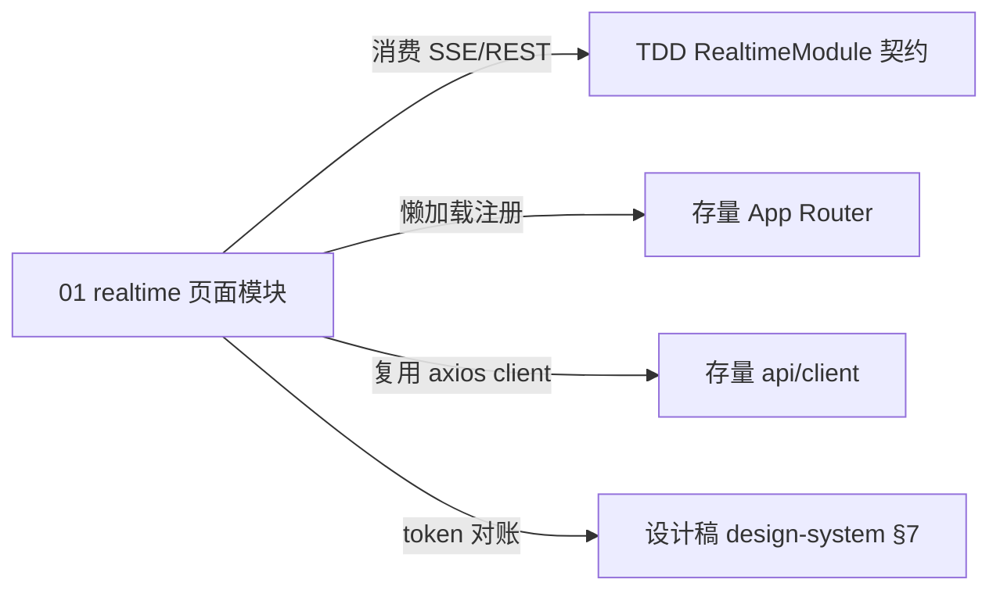

# 前端技术方案总纲（FTDD）— web-monitor 实时大屏（V1）

> 文档状态：`[待评审]`　|　创建：2026-09-18　|　责任：Frontend-Tech-Design
> IRON LAW：澄清即定稿。**选型策略：本需求是存量看板（React18 + Vite6 + TS + AntD5 + ECharts + zustand + axios + react-router6）上的单页增量，选型以「继承存量」为第一原则；新增决策仅限 SSE 消费层与页面主题承载（§2 关键决策）**。

## 1. 元数据
| 项 | 内容 |
|---|---|
| 需求基线 | `.spec/PRD/V1/`（28 AC）　|　结构基线：`.spec/原型/`　|　视觉基准：`.spec/设计稿/`（实时大屏.html v4 + design-system.md §7 34 token） |
| 接口契约 | `.spec/TDD/V1/`（RealtimeModule：SSE stream + REST snapshot） |
| 档位 | 继承存量（看板既有工程化水平；不为此增量引入企业级附加件） |
| 端形态 | Web PC（继承） |
| 框架/组件库/状态/路由/请求/构建 | 继承存量（React 18 hooks / AntD5 框架层 / zustand 全局 / react-router 6 嵌套路由 / axios 封装 / Vite 6） |

## 2. 技术选型总览（本增量新决策 · 含关键决策记录）
| # | 决策 | 结论 | 备选 | 理由 | 影响与代价 |
|---|---|---|---|---|---|
| D1 | SSE 客户端 | 原生 `EventSource` 封装为 `useRealtimeStream(appKey)`；断线重连交浏览器原生机制，`retry` 节奏由服务端帧控制 | 手写 WS 客户端 / react-query + 轮询 | 零依赖、服务端契约即 SSE；快照模型重连=取最新（TDD §7） | EventSource 不可自定义 header（服务端无鉴权，无影响） |
| D2 | 更新状态机 | hook 内派生四态：`connecting / live / interrupted / idle`；「曾成功过」标记区分首次失败（AC-M02-013）与更新失败（AC-M02-007） | 在服务端快照中加连接语义 | 连接状态属客户端关切，不污染服务端契约 | — |
| D3 | 数据获取模式 | **SSE 为主 + REST 快照兜底**：EventSource `onerror` 且从未成功 → 主动降级 REST 轮询（间隔=推送周期），恢复后自动切回 SSE | 纯 SSE | 断网/代理不支持 SSE 时大屏不死屏（PRD 体验底线） | 双通道代码路径（hook 内收敛） |
| D4 | 页面主题承载 | 深色仅作用于页面容器 `.realtime-screen`（CSS 变量作用域），**不启用全局暗黑主题切换**（PRD Out-of-Scope 多主题）；大屏页内不使用 AntD 组件（避免浅色组件库主题割裂），框架层（AppLayout）继续 AntD | AntD darkAlgorithm 全局切换 | 影响面最小、挂屏视觉纯净 | 页内控件需自实现（仅切换器下拉一个，成本可控） |
| D5 | Token 来源 | `.spec/设计稿/design-system.md` §7 **34 条**为唯一来源 → 落 `src/features/realtime/theme.css` 的 `:root`/`.realtime-screen` CSS 变量；**登记 34 条**，开发期逐条对账 | 按 AntD token 推导 | 视觉基准唯一来源纪律（baseline-terms） | — |
| D6 | 图表实现 | 趋势双曲线=ECharts（存量依赖，深色 token 配置）；达标率环=自绘 SVG（4 个轻量环，与设计稿一致） | 全自绘 SVG / 全 ECharts | 各取所长，零新依赖 | — |
| D7 | 样式方案 | **CSS Modules（`.module.css`）+ 全局 `theme.css`**；不为此增量引入 Sass/Less（存量无预处理器，快速档不新增） | Sass | 与存量工程一致 | 放弃嵌套语法（可接受） |
| D8 | 请求载体 | REST 快照走**存量 axios 封装**（`src/api/client.ts`）；SSE 走原生 EventSource——FTDD 基线「统一 fetch」在此让位于存量一致性（偏差声明，评审可议） | 新建 fetch 封装 | 一个工程两套请求层是更大的恶 | — |
| D9 | 测试栈 | 新增 devDeps：`vitest + jsdom + @testing-library/react`（存量 dashboard 无测试）；页面逻辑层（hook 状态机）为主要测试对象 | 不测试（违反 TDD 纪律） | `pnpm --filter dashboard test` 从占位变可用 | 新增 4 个 dev 依赖 |
| D10 | 醒目标识 | 错误流「新」高亮由**前端本地比对**上一轮快照的 fingerprint 集合得出（服务端契约不携带，PRD A12） | 服务端标记 | 服务端无状态保持简单 | 刷新页面后高亮基线重置（可接受） |

**Out-of-Scope（留痕）**：暗黑模式切换（大屏即深色，D4）、i18n（存量无）、旧浏览器兼容（Vite 默认现代浏览器；EventSource 为基线能力，显式声明）、移动端。

## 3. 前端架构图
```mermaid
flowchart LR
    subgraph 存量壳层
      ROUTE[React Router AppLayout] --> NAV[侧边导航 AntD]
    end
    subgraph 新增 realtime 页面（/realtime，懒加载）
      PAGE[RealtimeScreen 页面容器] --> HOOK[useRealtimeStream appKey 状态机]
      PAGE --> B1[AppSwitcherBar] & B2[AlertBanner] & B3[MetricCards] & B4[TrendPanel ECharts] & B5[ErrorStream] & B6[TopLists] & B7[VitalsRing SVG] & B8[状态横幅×3]
      HOOK --> ES[EventSource /stream]
      HOOK --> FB[axios /snapshot 兜底轮询]
    end
    theme[theme.css 34 token] -.-> PAGE
```

## 4. 页面清单（路由 + 基准映射）
| 路由 | 页面 | 职责 | 模块 | 结构基线（原型） | 视觉基准（设计稿） |
|---|---|---|---|---|---|
| `/realtime` | RealtimeScreen | 单应用实时大屏（七区块 + 状态机） | 01 | `原型/index.html` + 布局清单 | `设计稿/实时大屏.html` v4 |

## 5. 组件清单
| 组件 | 层级 | 职责 | 数据来源 |
|---|---|---|---|
| RealtimeScreen | 页面容器 | 编排七区块 + 状态机分支（正常/失败/首次失败/无数据/应用被删/无应用/加载中） | useRealtimeStream |
| AppSwitcherBar | 展示 | 应用下拉（本地受控）+ 统计时点 + 更新状态徽标 + 加载中标识 | props（snapshot + status + handlers） |
| AlertBanner | 展示 | 未恢复告警条目（点击新开视图跳告警页） | props(alerts.unresolved)；空→不渲染 |
| MetricCards | 展示 | 7 张指标卡；醒目卡=当日值命中告警阈值（本地比对：alert.metric 枚举→metrics 键映射表落 api.ts 常量：error_rate→errorRate、api_error_rate→接口成功率取反、未覆盖枚举不醒目） | props(metrics + highlight) |
| TrendPanel | 展示 | ECharts 双曲线（primary/danger） | props(trend) |
| ErrorStream | 展示 | 50 条倒序列表；本地比对得出「新」高亮（一轮消退）；「查看完整」本地展开；整行新开视图跳错误详情 | props(errors + prevFingerprints) |
| TopLists | 展示 | 三列榜单 | props(topLists) |
| VitalsRing | 展示 | 4 个 SVG 环 + 百分比（环心式） | props(vitals) |
| StatusBanners | 展示 | 更新失败（含最后时点）/ 首次失败（暂无已加载数据）/ 应用被删（warning）三横幅 | props(status + lastSuccessAt) |
| EmptyNoApp | 展示 | 「还没有接入应用」引导（跳接入指引） | props(hasApps) |

## 6. 工程目录结构（增量）
```
apps/dashboard/src/
├── features/realtime/
│   ├── RealtimeScreen.tsx            # 页面容器（懒加载入口）
│   ├── components/                   # 上表 9 个展示组件（*.tsx + *.module.css）
│   ├── hooks/useRealtimeStream.ts    # SSE 状态机（核心逻辑层）
│   ├── hooks/usePrevFingerprints.ts  # 「新」高亮比对
│   ├── api.ts                        # snapshot 兜底（复用 api/client）
│   └── theme.css                     # 34 token + 深色作用域
├── pages/RealtimePage.tsx            # 路由页（lazy → RealtimeScreen）
├── App.tsx                           # + <Route path="realtime" ...>
├── layouts/AppLayout.tsx             # + 侧边菜单新增「实时大屏」项（激活态，置于「总览」之后）
```

## 7. 模块清单与边界
| 模块 | 应做 | 不应做 |
|---|---|---|
| 01 realtime 页面模块 | 大屏页全部区块渲染、SSE 状态机、REST 兜底、异常态/空态、跳转出口、34 token 消费 | 不做全局主题切换、不做全局 store 改动（应用切换为页面本地状态，与全局 appKey 解耦——PRD 默认第一个应用不记忆）、不做告警配置、不改既有页面 |

## 8. 全局规范
- **fetch**：REST 复用 `src/api/client.ts`（axios 实例，含统一错误处理）；SSE 用原生 EventSource（D1/D8）。
- **命名**：组件 PascalCase、hooks useXxx、CSS Modules camelCase 类名。
- **UI 规范**：token 34 条（D5）；界面状态按「10 大 UI 状态」核对——加载中/空/成功/失败/部分失败/断线重连/应用被删/无应用/无数据/禁用（切换器在加载中不禁用，允许快速切换 PRD AC-M02-010）。
- **a11y**：WCAG 2.1 AA 基线——语义化（nav/main/section/h3）、切换器原生 select、错误流条目可聚焦（a 元素）、动效尊重 prefers-reduced-motion（ECharts animation 关闭开关）、对比度由设计稿 token 保证。
- **性能预算**：`/realtime` 路由级懒加载（React.lazy）；ECharts 按需引入（增量包 ≤ 120KB gzip）；快照渲染不做虚拟化（50 条上限）；「新」高亮定时器在卸载时清理。

## 9. 测试策略
Vitest + RTL（D9）：① `useRealtimeStream` 状态机测试（mock EventSource：首帧/live→interrupted→恢复/firstfail/切换重连/REST 兜底切换，AC-M02-004/007/013）；② 组件渲染测试（六态分支、告警横幅显隐 AC-M02-006、错误流截断+查看完整 AC-M02-012、快速切换以最后为准 AC-M02-010）；③ token 对账测试（theme.css 变量数=34）。

## 10. 模块关联图

