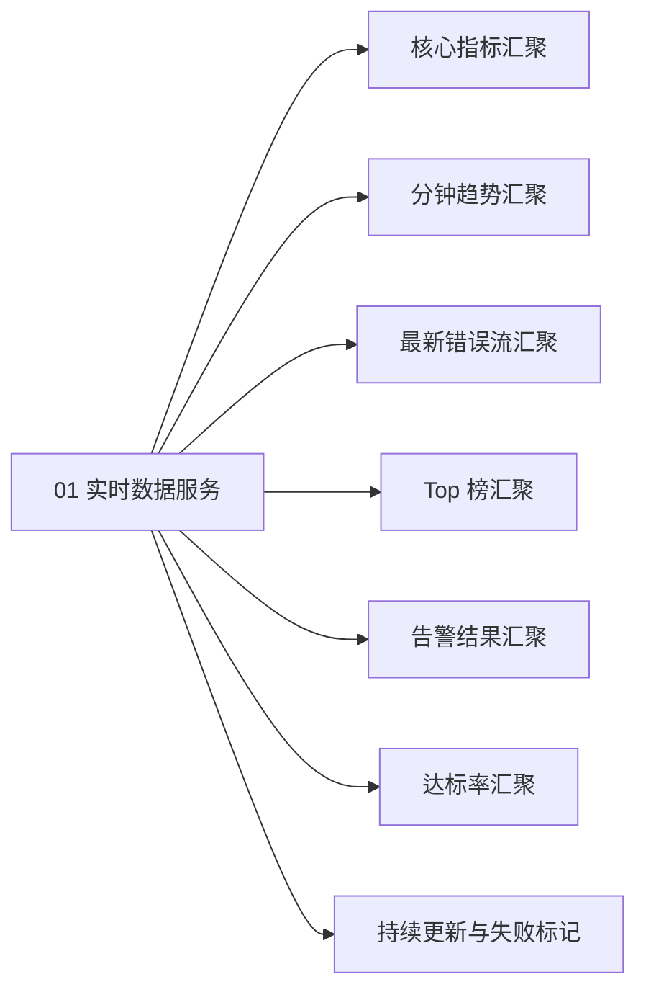

# 【模块规格】01_实时数据服务

> **所属需求**：web-monitor 实时大屏（V1）　|　**模块定位**：为实时大屏持续供数的服务端能力
> **责任 PM**：Workflow 编排（PRD-Design）　|　**文档状态**：`[待评审]`

---

## 1. 模块概述与边界

### 1.1 定位与业务价值
把平台已经采集到的原始监控数据，按「大屏」的使用假设重新组织：以单个应用为范围，持续供给六类状态数据（核心指标、分钟趋势、最新错误流、Top 榜、未恢复告警、达标率），并附带数据统计时点与失败标记。它是大屏的「数源」，让大屏不需要人工查询就能持续呈现最新状态。

### 1.2 应做 / 明确不应做（负向边界）
| 应做 | 明确不应做 |
|---|---|
| 按应用汇聚六类大屏数据（见 §5 口径） | 不做数据采集与上报接收（既有上报链路职责） |
| 提供数据统计时点，数据不可用时提供失败标记与最后成功时点 | 不做告警规则的判定与触达（既有告警引擎职责，本模块只读其产生的告警结果） |
| 支持数据持续更新（消费方无需重新发起「查询动作」即可获得后续数据） | 不做历史区间报表、导出、对比分析（常规看板职责） |
| 对无数据应用返回零值与补空序列（而非报错，口径见 §5 规则 10） | 不决定大屏布局、哪些数据上墙（M02 职责）；不做持续更新通道之外的存储新表设计（归技术方案） |

### 1.3 需求条目索引（REQ 编号）
| 需求编号 | 需求名称 | 一句话诉求 | 优先级 | 对应场景 | 关联 AC | 来源 |
|---|---|---|---|---|---|---|
| `REQ-M01-001` | 核心指标供数 | 提供单应用当日核心指标（PV、UV、错误数、错误率、性能评分、活跃会话、接口成功率） | `P0` | S1 | `AC-M01-001/009/010` | 既有总览口径 + 【设计假设 A1/A4】 |
| `REQ-M01-002` | 分钟趋势供数 | 提供最近 60 分钟逐分钟的访问量与错误数序列 | `P0` | S1 | `AC-M01-002` | 【设计假设 A2】 |
| `REQ-M01-003` | 最新错误流供数 | 提供按发生时间倒序的最新错误事件流（含错误类型、消息、页面、发生时间与跳转定位标识） | `P0` | S1 | `AC-M01-003` | 【设计假设 A3】 |
| `REQ-M01-004` | Top 榜供数 | 提供慢接口、JS 错误、性能最差页面三个维度各前 5 的排行数据 | `P1` | S1 | `AC-M01-004/013` | 【设计假设 A6】 |
| `REQ-M01-005` | 告警结果供数 | 提供当前未恢复告警列表及近 24 小时告警记录（含状态区分） | `P0` | S1 | `AC-M01-005/012` | 存量告警结果数据 + 【设计假设 A5/A11】 |
| `REQ-M01-006` | 达标率供数 | 提供 LCP/INP/CLS 各自达标率与综合达标率 | `P1` | S1 | `AC-M01-006/014` | 既有达标率口径 + 【设计假设 A7】 |
| `REQ-M01-007` | 持续更新与失败标记 | 数据持续更新；不可用时给出失败标记与最后成功时点，恢复后继续供给；多消费方互不干扰 | `P0` | S2 | `AC-M01-007/008/011/015` | 场景 3（降级） |

### 1.4 用户故事集
- **故事 1**：作为值班研发，我想让大屏数据自己持续更新，以便不刷新页面也能看到最新线上状态。→ REQ-M01-001~007
- **故事 2**：作为值班研发，我想在大屏断更时明确知道「数据到什么时刻为止」，以便不把陈旧数据误读为当前状态。→ REQ-M01-007

---

## 2. 前置条件与后置影响

### 2.1 模块关联关系标注
| 关联方向 | 关联模块/系统 | 传递的业务产物/前提 |
|---|---|---|
| 上游依赖 | 既有上报数据存储 | 原始访问、错误、接口、性能事件 |
| 上游依赖 | 既有上报/会话能力 | 会话标识（活跃会话按其去重计数） |
| 上游依赖 | 既有告警引擎 | 已产生的告警记录（含未恢复/已恢复状态） |
| 下游承接 | 02 实时大屏视图 | 六类大屏数据 + 数据统计时点 + 失败标记 |

### 2.2 前置条件（进入本模块业务的硬性前提）
1. **进入入口**：由大屏页面（M02）按应用发起数据供给请求；应用必须存在于存量应用清单中；
2. **身份与权限**：沿用看板既有登录态（本模块不做新权限）；
3. **前序业务状态**：平台既有上报链路在产数据（数据有无不影响服务可用性，只影响内容为零）；
4. **信息完整性**：应用标识（appKey）有效。

### 2.3 后置影响（本模块办结后的连锁反应）
1. **状态变化**：无（本模块为只读供数，不改变任何业务数据状态）；
2. **下游驱动**：M02 获得可渲染的数据与统计时点；失败标记驱动 M02 呈现「更新中断」态。

---

## 3. 信息结构与场景操作步骤流

### 3.1 页面功能区块说明
- 本模块为服务端供数能力，无自有页面；页面承载归 M02。

### 3.2 场景操作步骤流

#### 场景 S1：正常供数（对应 REQ-M01-001~006）
| 步骤 | 从哪进入 | 谁 | 做什么 | 系统给出什么 | 流向哪里 |
|---|---|---|---|---|---|
| 1 | M02 按选定应用发起 | M02 | 请求该应用的大屏数据 | — | 进入数据汇聚 |
| 2 | — | 本模块 | 校验应用有效后汇聚六类数据 | — | 生成数据结果 |
| 3 | — | 本模块 | 附带数据统计时点返回 | 六类数据 + 统计时点 | M02 渲染（其场景 S1） |
| 4 | — | 本模块 | 持续供给后续数据 | 后续各轮数据（各带新统计时点） | M02 持续刷新呈现 |

**异常推演**

| 异常 | 推演结论：用户看到什么 / 还能做什么 |
|---|---|
| 应用不存在或已删除 | 返回明确的「应用无效」结果；M02 据此提示并引导回应用切换（用户看到「该应用不可用」，可换应用） |
| 应用有效但尚无任何数据 | 不报错；六类数据按零值与补空序列返回并照带统计时点；用户看到各区块空态而非报错 |

#### 场景 S2：供数中断与恢复（对应 REQ-M01-007）
| 步骤 | 从哪进入 | 谁 | 做什么 | 系统给出什么 | 流向哪里 |
|---|---|---|---|---|---|
| 1 | 数据源异常/内部故障 | 本模块 | 无法产出最新数据 | 失败标记 + 最后一次成功的统计时点 | M02 呈现更新中断态 |
| 2 | — | 本模块 | 故障解除后自动恢复供给 | 恢复后的数据（新统计时点） | M02 回到正常更新 |

**异常推演**

| 异常 | 推演结论：用户看到什么 / 还能做什么 |
|---|---|
| 部分数据类目失败、部分成功 | 整轮数据以「部分失败」标记供给，失败类目置空并注明；不以上一轮旧数据冒充该类目最新值 |
| 持续失败 | 持续返回失败标记与最后成功时点，直至故障解除；不静默降频到不可感知 |

---

## 4. 模块结构图与业务流程（Mermaid）

### 4.1 模块结构图


### 4.2 模块业务流程图
```mermaid
flowchart TD
    Start([🚀 M02 发起大屏数据请求]) --> Valid{应用是否有效}
    Valid -->|否| Invalid[返回应用无效结果] --> EndStop([⛔ 本轮终止])
    Valid -->|是| Gather[汇聚六类数据]
    Gather --> Avail{数据是否可用}
    Avail -->|部分或全部不可用| Mark[置失败标记并附最后成功时点] --> Return[返回数据结果与统计时点]
    Avail -->|全部可用| Return
    Return --> Loop[等待下一轮持续供给]
    Loop -->|继续供给 [退出条件：M02 停止消费/离开页面]| Gather
```

### 4.3 对象生命周期状态机
- 本模块无独享生命周期对象（数据为只读快照、随取随新）；「更新通道」业务状态机注册于总纲 §9.2，此处不重复。

---

## 5. 业务逻辑与计算规则

1. **统计范围**：除趋势（最近 60 分钟）与错误流（容量窗口）外，各类指标统计范围为**当日 00:00（服务端时区）至统计时点**【设计假设 A1】；
2. **趋势口径**：以统计时点所在分钟为终点、**含终点共 60 个点**的逐分钟序列，含访问量与错误数两条；无数据的分钟以空值补位（固定 60 点补空，不返回空序列）【设计假设 A2】；
3. **错误流容量与排序**：按发生时间倒序，容量最新 50 条【设计假设 A3】；每条含错误类型、消息、所属页面、发生时间，以及**错误事件标识**（沿用存量错误详情的定位方式，供视图侧跳转详情使用）；
4. **Top 榜口径**：慢接口 = 按「接口名 + 请求方法」聚合（沿用存量接口统计页聚合口径）平均耗时最高的前 5；JS 错误 = 发生次数最多的错误前 5；最差页面 = 按存量页面加载耗时口径（平均加载耗时）最高的页面前 5【设计假设 A6】；数据不足 5 条时按实际条数返回；
5. **告警结果口径**：未恢复告警 = 状态为「未恢复」的告警记录，供数上限 100 条（超出按触发时间最新优先）【设计假设 A11】；同时提供最近 24 小时内触发的告警记录（含已恢复，状态字段区分）——**本期大屏横幅只消费未恢复告警，近 24h 记录为数据预留、不上墙**【设计假设 A5】；
6. **活跃会话口径**：统计时点前 5 分钟内产生过上报事件的会话数，按存量会话标识去重【设计假设 A4】；
7. **达标率口径**：沿用存量「良好阈值事件占比」口径，含 LCP、INP、CLS 三项各自达标率与三项综合达标率【设计假设 A7】；无样本时返回空并注明；
8. **接口成功率口径**：沿用存量总览页口径（成功接口响应数占全部接口响应数的比例，当日范围），本模块不另行定义；
9. **数值精度与单位**：沿用存量看板展示口径（比率保留整数百分比、耗时以毫秒计）；**比率类指标（错误率、达标率、接口成功率）无样本时返回空并注明，此为零值语义的显式例外**；
10. **零值语义**：应用无数据 = 合法结果（零值 + 趋势按 60 点补空 + 照常给统计时点），与「数据不可用（失败标记）」严格区分；
11. **失败标记适用范围**：失败标记仅覆盖「服务可达但本轮供数失败」；网络连接中断导致消费方收不到数据时，由视图侧按更新周期超时判定（机制归技术方案，见 A10）；
12. **谁可以看**：沿用存量应用级可见范围校验与看板登录态（校验随存量现状承接），本模块不新增权限模型。

---

## 6. 复杂度预警（产品层技术评估）

| 维度 | 结论 | 说明 |
|---|---|---|
| 复杂度评级 | `[中]` | 单应用聚合查询本身不复杂；复杂在「持续更新」与多消费方并存时的供给压力 |
| 关键依赖能力 | 高频数据聚合能力、持续数据下发能力（点能力类别不点具体协议/组件） | 六类数据每轮实时聚合，聚合窗口小、频次高 |
| 潜在瓶颈 | 多个大屏同时挂屏时，同一应用被重复聚合；事件量突增时聚合压力放大 | 涨 10 倍（应用数×挂屏数×事件量）时聚合与下发放大为首要瓶颈 |
| 降级兜底思路 | 数据供给可自动降低更新频次（保持可用、变慢），并保证失败标记语义不丢；同一应用短时间内的聚合结果允许对多个消费方复用 | 降级目标 = 大屏「变慢不变成死屏」，M02 侧始终有统计时点可依赖 |

---

## 7. 异常分支矩阵（业务语言）

| 编号 | 类别 | 触发场景 | 用户看到什么 | 还能做什么 |
|---|---|---|---|---|
| E-01 | 空数据态 | 应用新接入、尚无上报数据 | 各区块空态/零值，附统计时点（非报错） | 继续观察；去引导接入流量 |
| E-02 | 超限极值 | 错误事件超出流容量 | 错误流只保留最新 50 条，最旧的被移出 | 看全量历史去既有错误页 |
| E-03 | 等待过久/中断 | 数据源异常、服务内部故障 | （由 M02 呈现）更新失败标识 + 最后成功时点 | 等待自动恢复；或离开页面 |
| E-04 | 重复操作 | 多个大屏同时消费同一应用 | 各自正常供给，互不影响 | — |
| E-05 | 无权使用 | 登录态失效 | 沿用看板既有未登录处理（沿用存量行为，本期不纳入本模块验收，见 AC-M01 覆盖自检） | 重新登录后回到大屏 |
| E-06 | 业务特有 | 应用不存在/已删除 | 应用无效结果（M02 转译为提示与引导） | 切换到其他应用 |

---

## 8. 业务信息清单（业务信息三列清单）

| 信息项 | 业务含义 | 业务规则（必填与否/可选值/上限） |
|---|---|---|
| 核心指标组 | 当日 PV、UV、错误数、错误率、性能评分、活跃会话数、接口成功率 | 必返；无数据时为零值（比率类无样本为空，见 §5 规则 9）；口径见 §5 规则 1/6/8 |
| 趋势序列 | 逐分钟访问量与错误数 | 必返；以统计时点所在分钟为终点、含终点共 60 个点，无数据分钟补空 |
| 错误流条目 | 单条最新错误：类型、消息、所属页面、发生时间、错误事件标识（跳转定位用） | 必返；倒序；容量 50；超长文本按视图侧展示底线处理，供数不截断 |
| Top 榜条目 | 三个榜单各自的条目名称与对应值（接口名+方法+耗时 / 错误消息+次数 / 页面+耗时） | 必返；各前 5、不足按实际 |
| 告警条目 | 单条告警：规则名、命中指标、当前值、阈值、触发时间、未恢复/已恢复状态 | 必返；未恢复（上限 100，最新优先）+ 近 24 小时记录【设计假设 A5/A11】 |
| 达标率组 | LCP/INP/CLS 各自达标率与综合达标率 | 必返；无样本时为空并注明【设计假设 A7】 |
| 数据统计时点 | 本轮数据统计截止时刻 | 每轮必带 |
| 失败标记 | 本轮数据是否可用（全部可用 / 部分类目失败 / 全部失败） | 不可用时必带；附带最后成功统计时点；适用范围见 §5 规则 11 |

---

## 9. 验收标准（Gherkin 单源 · TDD 输入源）

```gherkin
Feature: 实时数据服务
  作为实时大屏的供数方，我希望按应用持续供给六类状态数据，以便大屏无需人工查询即可持续呈现最新状态

  # ===== REQ-M01-001 核心指标供数 =====
  Scenario: AC-M01-001【P0】返回单应用当日核心指标
    Given 平台已接入应用且当日已产生访问与错误数据
    When 以该应用发起大屏数据供给
    Then 返回结果包含当日 PV、UV、错误数、错误率、性能评分、活跃会话数、接口成功率
    And 错误率、性能评分、接口成功率口径与存量总览页一致，活跃会话按 §5 规则 6 口径计算
    And 结果附带数据统计时点

  # ===== REQ-M01-002 分钟趋势供数 =====
  Scenario: AC-M01-002【P0】返回最近 60 分钟逐分钟趋势
    Given 该应用最近 60 分钟内有访问与错误数据
    When 以该应用发起大屏数据供给
    Then 返回逐分钟的访问量序列与错误数序列
    And 序列以统计时点所在分钟为终点、含终点共 60 个点
    And 无数据的分钟以空值补位

  # ===== REQ-M01-003 最新错误流供数 =====
  Scenario: AC-M01-003【P0】按发生时间倒序返回最新错误流
    Given 该应用已产生超过 50 条错误事件
    When 以该应用发起大屏数据供给
    Then 返回的错误流条目不超过 50 条且按发生时间从新到旧排列
    And 每条包含错误类型、消息、所属页面、发生时间与错误事件标识

  # ===== REQ-M01-004 Top 榜供数 =====
  Scenario: AC-M01-004【P1】返回三个维度 Top 榜
    Given 该应用当日已有接口调用、JS 错误与页面加载数据
    When 以该应用发起大屏数据供给
    Then 返回慢接口、JS 错误、性能最差页面三个榜单，各不超过 5 条
    And 榜单条目按各自口径排序（慢接口按平均耗时、JS 错误按发生次数、最差页面按平均加载耗时）

  # ===== REQ-M01-005 告警结果供数 =====
  Scenario: AC-M01-005【P0】返回未恢复告警
    Given 该应用存在一条状态为「未恢复」的告警记录
    When 以该应用发起大屏数据供给
    Then 返回结果包含该未恢复告警，且包含其规则名、命中指标、当前值、阈值与触发时间

  # ===== REQ-M01-006 达标率供数 =====
  Scenario: AC-M01-006【P1】返回三项 Core Vitals 达标率与综合达标率
    Given 该应用当日已产生性能采样数据
    When 以该应用发起大屏数据供给
    Then 返回 LCP、INP、CLS 各自达标率与三项综合达标率，口径与既有性能页一致

  # ===== REQ-M01-007 持续更新与失败标记 =====
  Scenario: AC-M01-007【P0】数据不可用时给出失败标记与最后成功时点
    Given 大屏数据供给处于正常状态
    When 服务可达但数据源异常导致本轮无法产出最新数据
    Then 返回失败标记与最后一次成功的统计时点
    And 不以旧数据冒充最新数据

  Scenario: AC-M01-008【P0】故障解除后自动恢复供给
    Given 数据供给处于失败标记状态
    When 数据源故障解除
    Then 在技术方案定义的恢复时限内自动恢复供给并携带新的统计时点，无需消费方重新建立供给关系

  # ===== 场景 S1 异常推演 =====
  Scenario: AC-M01-009【P1】无数据应用返回零值而非报错
    Given 某应用已接入但从未产生任何上报数据
    When 以该应用发起大屏数据供给
    Then 返回零值，趋势序列按 60 点补空规则返回，并正常附带统计时点，不作为失败处理

  Scenario: AC-M01-010【P1】应用无效时返回明确无效结果
    Given 请求供给的应用标识不存在于应用清单
    When 以该应用发起大屏数据供给
    Then 返回应用无效结果，不返回任何大屏数据

  # ===== 场景 S2 异常推演 =====
  Scenario: AC-M01-011【P2】部分类目失败时整轮部分失败标记
    Given 数据供给正常
    When 仅达标率类目汇聚失败、其余类目正常
    Then 本轮以部分失败标记供给，失败类目置空并注明，其余类目数据正常返回

  # ===== REQ-M01-005 近 24 小时记录（SUM-03） =====
  Scenario: AC-M01-012【P1】近 24 小时告警记录随供数返回并区分状态
    Given 该应用近 24 小时内存在一条已恢复告警，且当前另有一条未恢复告警
    When 以该应用发起大屏数据供给
    Then 近 24 小时内的已恢复告警记录被返回且状态字段标明「已恢复」
    And 未恢复告警记录的状态字段标明「未恢复」
    And 两类记录的展示与否由视图侧横幅规则决定（本期横幅仅消费未恢复告警）

  # ===== 边界（SUM-16） =====
  Scenario: AC-M01-013【P2】Top 榜不足 5 条按实际条数返回
    Given 该应用当日仅有 2 个接口调用记录、无页面加载数据
    When 以该应用发起大屏数据供给
    Then 慢接口榜单返回 2 条，最差页面榜单返回空且不作为失败处理

  Scenario: AC-M01-014【P2】达标率无样本返回空并注明
    Given 该应用当日无任何性能采样数据
    When 以该应用发起大屏数据供给
    Then LCP、INP、CLS 达标率与综合达标率返回空并注明「无样本」，而非返回零值

  # ===== E-04 并发隔离（SUM-11） =====
  Scenario: AC-M01-015【P1】多个消费方同时消费同一应用互不干扰
    Given 两个大屏（消费方）同时以同一应用建立数据供给
    When 该应用持续产生新数据
    Then 两个消费方各自收到完整数据与各自的统计时点，互不缺失、互不串扰
```

### AC 覆盖度自检
- [x] 每条步骤流场景至少对应 1 条 AC（S1→001~006/009/010/012/013/014，S2→007/008/011/015）；
- [x] 异常矩阵每一行都有对应 AC（E-01→009，E-02→003，E-03→007/008，E-04→015，E-05→沿用存量未登录处理，本期不纳入本模块验收，E-06→010）；
- [x] 每个 REQ 至少 1 条 AC，REQ ↔ AC 双向可追溯（见 §1.3 关联 AC 列）；
- [x] 编号 AC-M01-001~015 连续无跳号；优先级齐全。
