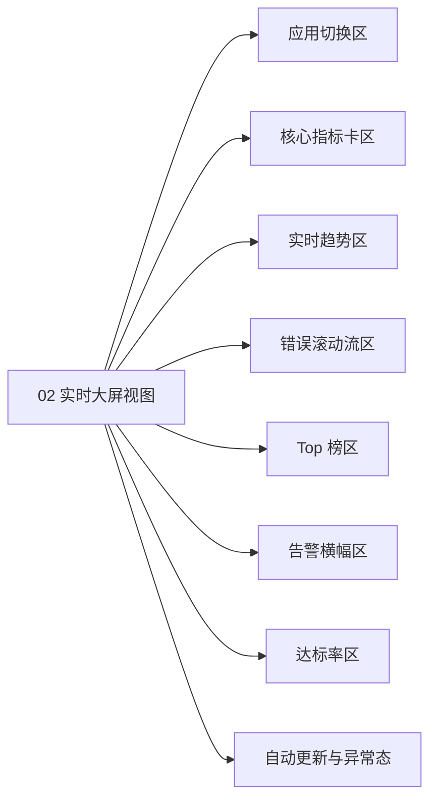
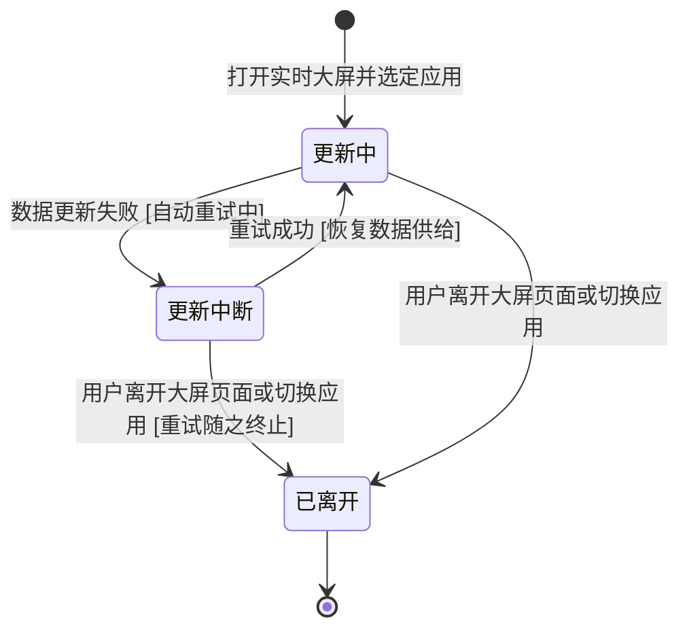

# 【模块规格】02_实时大屏视图

> **所属需求**：web-monitor 实时大屏（V1）　|　**模块定位**：看板内的近实时状态大屏页面
> **责任 PM**：Workflow 编排（PRD-Design）　|　**文档状态**：`[待评审]`

---

## 1. 模块概述与边界

### 1.1 定位与业务价值
看板左侧导航的一级入口页面：以深色大屏视觉形态，呈现单个应用的六区块实时状态，数据持续自动更新、异常醒目浮现、一键跳转处置。它把「人工翻页拼判断」变成「一屏常挂看态势」，是本需求直接面向用户的价值出口。

### 1.2 应做 / 明确不应做（负向边界）
| 应做 | 明确不应做 |
|---|---|
| 大屏页面框架：导航入口、深色大屏形态、应用切换器 | 不做多应用聚合视图、多应用自动轮播（V2） |
| 六区块渲染：指标卡、趋势图、错误滚动流、Top 榜、告警横幅、达标率环形图 | 不做告警规则的增删改（既有告警页职责） |
| 数据自动更新与数据统计时点展示；更新中断提示与自动恢复 | 不做会话回放嵌入（跳既有详情页）；不做地域地图 |
| 异常醒目呈现与跳转处置（错误条目→错误详情、告警横幅→告警页） | 不做移动端适配、多主题切换、新权限体系；不改任何业务数据（只读） |

### 1.3 需求条目索引（REQ 编号）
| 需求编号 | 需求名称 | 一句话诉求 | 优先级 | 对应场景 | 关联 AC | 来源 |
|---|---|---|---|---|---|---|
| `REQ-M02-001` | 大屏页面框架 | 导航一级入口 + 深色大屏布局 + 应用切换区（默认选第一个应用） | `P0` | S1 | `AC-M02-001/002/010` | 用户澄清结论 |
| `REQ-M02-002` | 六区块呈现 | 六类内容同屏呈现，布局远距离可读，超长文本有展示底线 | `P0` | S1 | `AC-M02-003/012` | 用户澄清结论（全量六模块） |
| `REQ-M02-003` | 自动更新与时点 | 数据持续自动更新；页面展示数据统计时点 | `P0` | S1 | `AC-M02-004` | 场景 1 |
| `REQ-M02-004` | 异常醒目与跳转处置 | 错误流条目点击新开视图跳错误详情；告警横幅条目点击新开视图跳告警页并定位 | `P0` | S2 | `AC-M02-005/006` | 场景 2 |
| `REQ-M02-005` | 异常态呈现 | 更新失败（含首次加载失败）标示与自动恢复；无数据/无应用时空态引导 | `P0` | S3 | `AC-M02-007/008/009/011/013` | 场景 3（降级） |

### 1.4 用户故事集
- **故事 1**：作为值班研发，我想把大屏挂在办公区屏上不用管它，以便异常自己蹦出来。→ REQ-M02-002/003
- **故事 2**：作为值班研发，我想点大屏上的错误条目直达详情，以便最快开始处置。→ REQ-M02-004
- **故事 3**：作为团队负责人，我想在站会投出大屏并切换到目标应用，以便当场回答「现在线上如何」。→ REQ-M02-001

---

## 2. 前置条件与后置影响

### 2.1 模块关联关系标注
| 关联方向 | 关联模块/系统 | 传递的业务产物/前提 |
|---|---|---|
| 上游依赖 | 01 实时数据服务 | 六类大屏数据 + 数据统计时点 + 失败标记 |
| 上游依赖 | 存量·应用管理 | 可切换的应用清单 |
| 下游承接 | 存量·错误与溯源 | 接收错误条目跳转（进错误详情） |
| 下游承接 | 存量·告警管理 | 接收告警跳转（查看告警） |

### 2.2 前置条件（进入本模块业务的硬性前提）
1. **进入入口**：看板左侧导航「实时大屏」一级入口；
2. **身份与权限**：沿用看板既有登录态；
3. **前序业务状态**：应用清单非空（为空时进入空态引导，不阻塞页面本身）；
4. **信息完整性**：需选定一个应用（默认自动选中清单第一个，用户可切换）。

### 2.3 后置影响（本模块办结后的连锁反应）
1. **状态变化**：无（只读视图）；
2. **下游驱动**：跳转请求带动既有错误详情页、告警页被访问；不产生任何数据变更。

---

## 3. 信息结构与场景操作步骤流

### 3.1 页面功能区块说明
- **进入/去向**：从左侧导航「实时大屏」进入；点击错误条目/告警横幅以新开视图方式前往既有「错误详情」页与「告警管理」页（大屏本体保持不中断）；关闭新开视图即回到大屏
- **区块 A｜应用切换区**：承载应用选择（默认第一个应用）与数据统计时点展示（术语表注册名「应用切换区」，正文简称「切换器」均指本区块）
- **区块 B｜核心指标卡区**：承载当日 PV、UV、错误数、错误率、性能评分、活跃会话、接口成功率的高对比数字卡
- **区块 C｜实时趋势区**：承载最近 60 分钟访问量与错误数两条曲线
- **区块 D｜错误滚动流区**：承载最新错误条目列表（倒序持续更新，容量内）
- **区块 E｜Top 榜区**：承载慢接口 / JS 错误 / 最差页面三个前 5 榜单
- **区块 F｜告警横幅区**：承载未恢复告警滚动提示（无未恢复告警时整体隐藏）
- **区块 G｜达标率区**：承载 LCP / INP / CLS 达标率环形图与综合达标率

### 3.2 场景操作步骤流

#### 场景 S1：打开大屏并持续观察（对应 REQ-M02-001/002/003）
| 步骤 | 从哪进入 | 谁 | 做什么 | 系统给出什么 | 流向哪里 |
|---|---|---|---|---|---|
| 1 | 左侧导航「实时大屏」 | 用户 | 点击进入 | 应用清单非空：自动选中第一个应用并开始加载；清单为空：见场景 S3 | 六区块加载中 |
| 2 | — | 用户 | （可选）通过切换器换应用 | 旧应用数据保留并叠加加载中反馈，新应用数据到达后整体替换 | 六区块刷新 |
| 3 | — | 系统 | 数据到达后呈现六区块，此后持续自动更新 | 各区块最新数据 + 统计时点随每次更新刷新 | 停留观察（持续循环步骤 3） |
| 4 | — | 用户 | 观察期间无需任何操作 | 更新期间旧数据保持可见、不被清空 | — |

**异常推演**

| 异常 | 推演结论：用户看到什么 / 还能做什么 |
|---|---|
| 首次加载时数据暂未到达 | 各区块明确的加载中反馈，非白屏干等 |
| 切换应用后新数据尚未到达 | 保留旧应用数据并叠加加载中反馈；新数据到达后整体替换，不出现新旧混排 |
| 某区块数据缺失 | 仅该区块空态并注明原因，其余区块正常呈现 |
| 切换器快速连续切换 | 以最后选定的应用为准加载，不出现新旧应用数据混排 |

#### 场景 S2：异常浮现与跳转处置（对应 REQ-M02-004）
| 步骤 | 从哪进入 | 谁 | 做什么 | 系统给出什么 | 流向哪里 |
|---|---|---|---|---|---|
| 1 | 大屏观察中 | 用户 | 注意到错误滚动流新增异常条目 / 告警横幅出现 | 异常条目按 §5 醒目触发规则获得醒目呈现 | 用户决定介入 |
| 2 | — | 用户 | 点击该错误条目 | 以新开视图方式打开既有错误详情页（按错误事件标识定位，大屏本体保持不中断） | 错误详情页（存量） |
| 3 | — | 用户 | （或）点击告警横幅中的告警条目 | 以新开视图方式打开既有告警管理页并定位到该告警 | 告警管理页（存量） |
| 4 | — | 用户 | 处置后关闭新开视图 | 回到未中断的大屏，按原应用继续自动更新 | 场景 S1 步骤 3 |

**异常推演**

| 异常 | 推演结论：用户看到什么 / 还能做什么 |
|---|---|
| 错误条目对应的详情已不存在（已被清理） | 详情页给出既有「不存在/已过期」说明；关闭详情视图即回到大屏继续观察 |
| 告警横幅展示期间告警被恢复 | 下一次数据更新后横幅随之隐藏，无需人工刷新 |

#### 场景 S3：异常态与空态（对应 REQ-M02-005）
| 步骤 | 从哪进入 | 谁 | 做什么 | 系统给出什么 | 流向哪里 |
|---|---|---|---|---|---|
| 1 | 数据更新失败（此前已有成功数据） | 系统 | 标示「更新失败 + 最后成功统计时点」，同时自动重试 | 用户明确知道当前数据只作数到什么时刻 | 重试成功→场景 S1 步骤 3 |
| 1a | 首次加载即失败（从未成功过） | 系统 | 标示更新失败与「暂无已加载数据」说明（无历史时点可展示），同时自动重试 | 用户知道是「还没拿到数据」而非「数据是旧的」 | 重试成功→场景 S1 步骤 3 |
| 2 | 平台无任何接入应用 | 系统 | 展示「还没有接入应用」引导 | 指向既有接入指引的引导入口 | 接入指引（存量） |
| 3 | 应用存在但无数据 | 系统 | 各区块空态与零值呈现（照常显示统计时点） | 用户知道是「没数据」而非「坏了」 | 停留观察 |

**异常推演**

| 异常 | 推演结论：用户看到什么 / 还能做什么 |
|---|---|
| 持续更新失败不恢复 | 失败标识与最后时点（或首次失败的「暂无已加载数据」说明）持续可见、自动重试持续进行；用户可切换应用或离开，回来时自动按最新状态加载 |
| 部分类目失败、部分成功 | 通道仍属「更新中」，成功区块正常展示最新值，失败区块就地标注失败原因；不用旧值冒充新值 |

---

## 4. 模块结构图与业务流程（Mermaid）

### 4.1 模块结构图


### 4.2 模块业务流程图
```mermaid
flowchart TD
    Start([🚀 进入实时大屏]) --> HasApp{应用清单是否非空}
    HasApp -->|否| Empty[展示无应用引导指向接入指引] --> EndLeave([⛔ 离开或去接入])
    HasApp -->|是| Select[自动选中第一个应用或用户切换]
    Select --> Load[按应用加载数据]
    Load --> Ok{数据是否到达}
    Ok -->|是| Render[呈现六区块与统计时点]
    Ok -->|否| Fail[标示更新失败与最后成功时点并自动重试]
    Fail --> Retry{重试是否成功}
    Retry -->|是| Render
    Retry -->|否 [退出条件：用户离开页面/切换应用则重试终止]| Fail
    Render --> Live[持续自动更新]
    Live -->|继续观察 [退出条件：离开页面/切换应用]| Live
    Render --> Jump[点击错误条目或告警横幅]
    Jump --> Detail[跳转既有详情页处置后可返回] --> Live
```

### 4.3 对象生命周期状态机（更新通道，注册于总纲 §9.2）


> **「离开」的判定口径**：点击错误条目/告警横幅以**新开视图**打开详情，大屏本体与更新通道均保持，**不计入「已离开」**；仅关闭/离开大屏页面本身或切换应用才进入「已离开」。返回大屏（如浏览器回退）= 按当前应用新建更新通道，效果等同继续更新。部分类目失败不改变通道状态（仍属「更新中」，由失败区块就地标注）。

---

## 5. 业务逻辑与计算规则

1. **应用默认选中**：进入大屏时默认选中应用清单中的第一个应用（沿用存量清单排序）；刷新/重开浏览器后同样回到默认选中，本期不做「记忆上次选择」【设计假设 A9】；切换应用后全部区块按新应用重新加载（过渡期保留旧数据并叠加加载中反馈），统计时点同步刷新；
2. **持续更新语义**：页面打开期间数据持续自动更新，用户无需刷新页面；更新机制与频率由技术方案定义（本文档不做数值承诺，验收 AC 以「技术方案定义的单轮更新周期 / 恢复时限」为等待判据，参数在该阶段落地）【设计假设 A10】；
3. **时点展示**：数据统计时点常驻展示于应用切换区，按服务端统计时点以「时:分」展示并标注「服务端时间」，不换算观看者本地时区；每次数据更新随之刷新；更新失败时展示最后成功时点；首次加载即失败时展示「暂无已加载数据」说明；
4. **跳转规则**：错误滚动流条目 → 以**新开视图**打开既有错误详情页（按错误事件标识定位，大屏本体与更新通道保持不中断）；告警横幅中的告警条目 → 以新开视图打开既有告警管理页并定位到所点告警（存量页不支持定位时到达列表页）；Top 榜与趋势、指标卡本期不挂跳转（只读展示）；
5. **告警横幅内容与显隐**：横幅只承载**未恢复告警**（滚动展示，多条时逐条轮示，点击对象为当前展示条目）；存在未恢复告警时展示横幅区，全部恢复后下一次数据更新时横幅整体隐藏；M01 提供的近 24h 已恢复记录本期不上墙（仅数据预留）【设计假设 A5】；
6. **醒目触发规则**（视觉呈现归设计稿，触发条件属业务规则）：① 错误滚动流「新增条目」= 与上一轮供数结果比对新出现的条目，醒目态持续到下一次数据更新完成（高亮一轮）【设计假设 A12】；② 告警横幅出现即醒目；③ 指标卡醒目条件 = 当日值命中该应用任一已启用告警规则的阈值（该应用无启用告警规则时，指标卡不做醒目）【设计假设 A11】；
7. **零值与空态区分**：「应用无数据」展示空态与零值（正常态）；「更新失败」展示失败标识与最后时点或「暂无已加载数据」（异常态），两者不允许混淆；
8. **展示底线**：错误消息、页面地址、接口名等超长文本默认截断展示，并提供查看完整内容的途径；大数值沿用存量看板的数量级格式化（具体样式归设计稿）。

---

## 6. 复杂度预警（产品层技术评估）

| 维度 | 结论 | 说明 |
|---|---|---|
| 复杂度评级 | `[中]` | 区块多但各自独立；复杂点集中在持续更新与异常态的体验闭环 |
| 关键依赖能力 | 可视化图表呈现能力、持续数据接收能力（能力类别） | 六区块 + 曲线/环形图，深色高对比视觉 |
| 潜在瓶颈 | 长时间挂屏的稳定性（内存/连接长期保持）；多区块同时刷新的呈现连贯性 | 挂屏数小时至数天为**设计目标**（非本期验收项，专项验收不做、见总纲 Out-of-Scope） |
| 降级兜底思路 | 单区块失败不影响整屏；更新中断有明确提示与自动恢复；极端情况用户可手动刷新页面兜底 | 保证「降级有感知、恢复全自动」 |

---

## 7. 异常分支矩阵（业务语言）

| 编号 | 类别 | 触发场景 | 用户看到什么 | 还能做什么 |
|---|---|---|---|---|
| E-01 | 空数据态 | 应用无数据 / 无任何接入应用 | 区块空态零值 / 无应用引导页（指向接入指引） | 继续观察 / 去接入 |
| E-02 | 超限极值 | 错误条目超出容量 | 只展示最新 50 条，更早的进既有错误页看 | 跳详情或错误页看全量 |
| E-03 | 等待过久/中断 | 数据更新失败、持续失败 | 更新失败标识 + 最后成功统计时点（首次加载失败则为「暂无已加载数据」说明），自动重试持续 | 等待自动恢复、切应用、离开 |
| E-04 | 重复操作 | 快速连续切换应用 | 以最后选定的应用为准，无新旧数据混排 | 正常使用 |
| E-05 | 无权使用 | 登录态失效 | 沿用看板既有未登录处理（沿用存量行为，本期不纳入本模块验收） | 重新登录后回到大屏 |
| E-06 | 业务特有 | 应用已被删除（切换器选中后失效） | 「该应用不可用」提示与切换引导 | 换其他应用 |

---

## 8. 业务信息清单（业务信息三列清单）

| 信息项 | 业务含义 | 业务规则（必填与否/可选值/上限） |
|---|---|---|
| 应用选择 | 当前大屏数据归属的应用 | 必选；默认清单第一个（刷新/重开亦回到默认）；可随时切换 |
| 数据统计时点 | 当前数据的统计截止时刻 | 常驻展示；「时:分」+「服务端时间」标注，不换算本地时区；更新失败展示最后成功时点；首次加载失败展示「暂无已加载数据」 |
| 指标卡数值组 | 当日 PV、UV、错误数、错误率、性能评分、活跃会话、接口成功率 | 必现；无数据为零值；醒目条件见 §5 规则 6（命中已启用告警规则阈值） |
| 趋势曲线 | 最近 60 分钟访问量与错误数曲线 | 必现；空数据时展示空态 |
| 错误条目 | 类型、消息、所属页面、发生时间、错误事件标识、醒目标识 | 容量 50、倒序；超长文本截断 + 可查看完整内容；点击按错误事件标识新开视图跳详情 |
| Top 榜条目 | 三个榜单的条目名称与数值 | 各前 5；不足按实际条数 |
| 告警条目 | 规则名、命中指标、当前值与阈值、触发时间 | 仅未恢复告警；存在时展示；点击新开视图跳告警页并定位 |
| 达标率组 | LCP/INP/CLS 达标率与综合达标率 | 必现；无样本时展示空态并注明 |
| 更新状态标识 | 正常更新中（含部分类目失败：失败区块就地标注，不整体转为失败态）/ 更新失败（自动重试中） | 异常态必现且与正常态可视区分；首次加载失败见 §5 规则 3 |

---

## 9. 验收标准（Gherkin 单源 · TDD 输入源）

```gherkin
Feature: 实时大屏视图
  作为值班研发，我希望大屏持续自动呈现单应用线上状态并让异常自己浮现，以便不刷新不翻页也能第一时间发现并处置问题

  # ===== REQ-M02-001 大屏页面框架 =====
  Scenario: AC-M02-001【P0】从导航进入大屏并默认选中应用
    Given 看板已登录且应用清单非空
    When 用户从左侧导航打开「实时大屏」
    Then 页面以大屏形态呈现，并已自动选中应用清单中的第一个应用
    And 数据统计时点可见

  Scenario: AC-M02-002【P0】切换应用后全部区块随之更新
    Given 大屏已展示应用甲的数据
    When 用户通过切换器选择应用乙
    Then 全部区块按应用乙重新呈现，不再残留应用甲的数据
    And 数据统计时点刷新为应用乙本轮数据的统计时点

  # ===== REQ-M02-002 六区块呈现 =====
  Scenario: AC-M02-003【P0】六区块完整呈现
    Given 已选定应用且该应用当日有访问、错误与性能数据，且当前存在未恢复告警
    When 大屏数据呈现完成
    Then 核心指标卡、趋势曲线、错误滚动流、三个 Top 榜、告警横幅区、达标率环形图六类内容全部可见
    And 各区块内容与供数结果一致（数值、条目、排序）

  # ===== REQ-M02-003 自动更新与时点 =====
  Scenario: AC-M02-004【P0】数据持续自动更新且时点刷新
    Given 大屏处于正常展示状态
    When 该应用产生新的访问与错误数据，到达下一轮更新（以技术方案定义的单轮更新周期为等待上限）
    Then 页面各区块在不做任何人工操作的情况下更新为最新数据
    And 数据统计时点随之刷新为新的统计截止时刻
    And 更新过程中旧数据保持可见，不出现整屏清空白屏

  # ===== REQ-M02-004 异常醒目与跳转处置 =====
  Scenario: AC-M02-005【P0】点击错误条目新开视图跳转错误详情
    Given 大屏错误滚动流中存在一条最新错误条目
    When 用户点击该条目
    Then 以新开视图方式打开既有错误详情页，可查看该错误的详情，且大屏本体保持展示不中断
    And 关闭该详情视图后，大屏按原应用继续自动更新（更新通道未中断）

  Scenario: AC-M02-006【P0】未恢复告警以横幅呈现且可跳转
    Given 当前应用存在未恢复告警
    When 大屏完成一轮数据呈现
    Then 告警横幅区出现并展示该告警的规则名、命中指标、当前值、阈值与触发时间
    And 未恢复告警全部恢复后，横幅区随下一次数据更新整体隐藏
    And 点击横幅中的告警条目，以新开视图打开既有告警管理页并定位到该告警

  # ===== REQ-M02-005 异常态呈现 =====
  Scenario: AC-M02-007【P0】更新失败时标示失败与最后时点并自动恢复
    Given 大屏处于正常更新状态
    When 数据更新失败
    Then 页面出现更新失败标识，且其呈现与正常更新状态可视区分，并展示最后一次成功的统计时点
    And 在技术方案定义的恢复时限内自动恢复：失败标识消失、各区块回到最新数据，全程无需人工刷新

  Scenario: AC-M02-008【P1】无任何接入应用时展示引导
    Given 平台尚未接入任何应用
    When 用户打开实时大屏
    Then 页面展示「还没有接入应用」的引导，并提供去往接入指引的入口

  Scenario: AC-M02-009【P1】无数据应用展示空态而非报错
    Given 选定的应用从未产生任何上报数据
    When 大屏完成一轮数据呈现
    Then 各区块以空态与零值呈现，统计时点正常展示，页面不出现失败或报错表达

  # ===== 场景 S1 异常推演 =====
  Scenario: AC-M02-010【P1】快速连续切换应用以最后选择为准
    Given 大屏已展示应用甲的数据
    When 用户在一次数据更新周期内先切换到应用乙、随即再切换到应用丙
    Then 页面最终稳定呈现应用丙的数据，全过程不出现甲乙丙数据混排

  Scenario: AC-M02-011【P2】所选应用已被删除时提示并可切换
    Given 切换器中的应用在某刻被删除
    When 用户仍选中该应用或该应用数据请求返回无效
    Then 页面提示「该应用不可用」并提供切换到其他应用的引导

  # ===== 展示底线（SUM-16） =====
  Scenario: AC-M02-012【P2】超长文本截断展示且可查看完整内容
    Given 错误滚动流中存在一条错误消息长度超出展示宽度的条目
    When 大屏完成一轮数据呈现
    Then 该条目以截断方式展示，且提供查看完整内容的途径

  # ===== 首次加载失败（SUM-13） =====
  Scenario: AC-M02-013【P1】首次加载失败展示失败标识与暂无数据说明
    Given 用户刚打开大屏，数据从未成功加载
    When 首次加载失败
    Then 页面出现更新失败标识并展示「暂无已加载数据」说明，而非展示某个历史统计时点
    And 自动重试持续进行，成功后各区块回到正常呈现
```

### AC 覆盖度自检
- [x] 每条步骤流场景至少对应 1 条 AC（S1→001/002/003/004/010，S2→005/006，S3→007/008/009/011/012/013）；
- [x] 异常矩阵每一行都有对应 AC（E-01→008/009，E-02→由 AC-M01-003 供数侧容量承接 + AC-M02-003「与供数结果一致」间接断言，E-03→007/013，E-04→010，E-05→沿用存量未登录处理、本期不纳入本模块验收，E-06→011）；
- [x] 每个 REQ 至少 1 条 AC，REQ ↔ AC 双向可追溯（见 §1.3 关联 AC 列）；
- [x] 编号 AC-M02-001~013 连续无跳号；优先级齐全。
