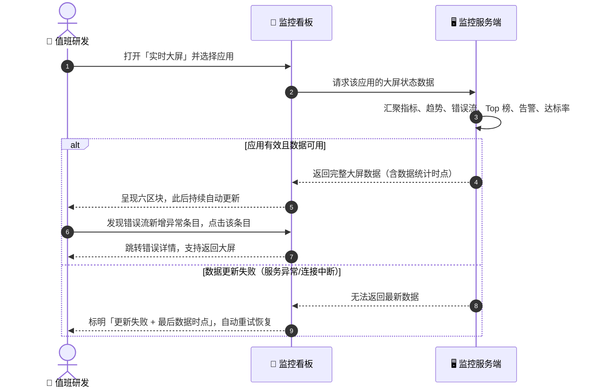
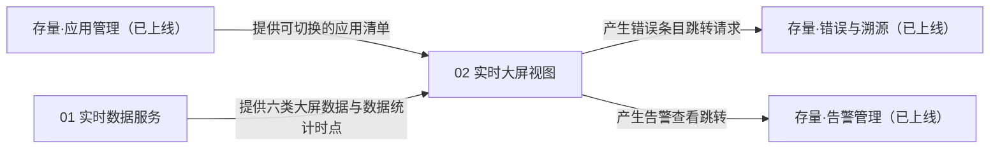
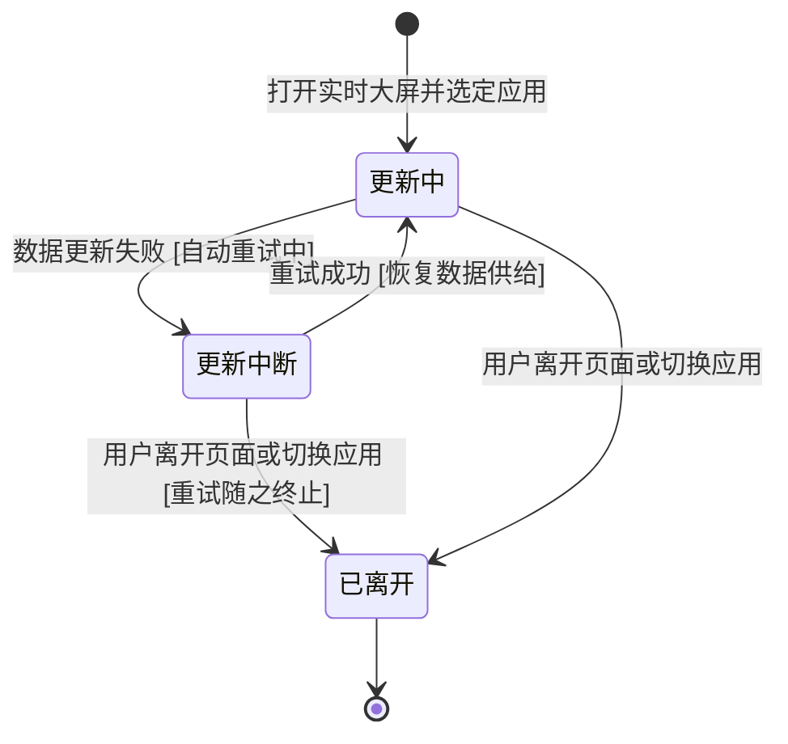

# 【需求总纲】web-monitor 实时大屏 PRD（V1）

> **文档状态**：`[待评审]`
> **所属版本**：V1　|　**责任 PM**：Workflow 编排（PRD-Design）　|　**创建/更新**：2026-09-18
>
> 📐 本文件是 **L1 模块大纲**：只写模块边界与依赖、全局导航与入口结构，不展开需求细节（细节在对应 `NN_xxx.md`）。

---

## 1. 文档元数据与变更记录

### 1.1 基本信息
| 字段 | 内容 |
|---|---|
| **项目名称** | web-monitor 实时大屏 |
| **所属业务线** | web-monitor 企业级前端监控平台（存量基建上的增量需求包） |
| **文档版本** | V1 |
| **参与人** | 产品（本 PRD）、后续评审的架构师/研发/QA/设计师 |

> **范围说明**：本 PRD 只覆盖「实时大屏」这一个增量功能。监控平台既有能力（采集 SDK、上报网关、双存储、错误溯源、会话回放、告警引擎、常规看板）均已上线，是本需求的既有前提，不在本文档重复定义。

### 1.2 版本变更记录
| 版本号 | 变更日期 | 变更类型 | 核心变更摘要 | 发起人 |
|---|---|---|---|---|
| `V1.0` | 2026-09-18 | 新增 | 0-1 首次建包（实时大屏功能） | PRD-Design |

---

## 2. 背景痛点与价值主张

- **市场/业务动因**：监控平台已具备完整的数据采集、存储、告警与常规看板能力，但常规看板以「人工查询」为使用假设——用户要自己刷新页面、在总览/错误/告警等多个页面之间跳转，才能拼出「现在线上好不好」的判断。
- **核心痛点**：
  1. 异常发生时（新错误爆发、告警触发），没有一个持续自动浮现异常的地方，值班人员靠「时不时刷新看板」发现问题，发现滞后；
  2. 团队需要向所有人持续展示线上态势时（办公区挂屏、站会投屏），现有页面信息密度和视觉形态都不适合远距离、无人操作观看。
- **价值主张**：一屏近实时看清单个应用的线上健康度——核心指标、趋势、最新错误、Top 问题、告警、性能达标率同屏呈现，数据持续自动更新，异常第一时间醒目浮现并可一键跳转处置。
- **本期关键取舍**：
  - 聚焦解决：单应用维度的近实时状态呈现、异常自动浮现、跳转处置闭环；
  - 暂缓/放弃：多应用聚合视图与自动轮播（V2 再评估，先保证单应用体验做透）、地域地图（数据已有但呈现价值低于六区块，避免首期摊子过大）、告警规则配置（既有告警页已覆盖，大屏只消费告警结果）。

---

## 3. 用户画像与核心场景（JTBD）

### 3.1 目标用户画像
| 角色编码 | 名称与画像描述 | 核心诉求与痛点 |
|---|---|---|
| U1 | 值班研发/运维：发布日或值班时段负责盯线上，通常把监控页面挂在大屏或副屏 | 异常要能自己蹦出来，而不是靠人反复刷新去找 |
| U2 | 研发团队负责人：站会、复盘时需要快速回答「现在线上状态如何」 | 一眼可判健康度，不用现场翻多个页面拼数据 |
| U3 | 团队全员：办公区共享屏的旁观者 | 远距离能看清关键数字与异常提示 |

### 3.2 核心 JTBD 场景
- **场景 1（高频主场景）**：在**值班/发布后观察期**情境下，值班人员想把监控挂上大屏**持续自动更新**，以便**不刷新、不翻页也能第一时间看到异常**。→ M01 全部 REQ、M02 REQ-001/002/003/004
- **场景 2（异常/逆向场景）**：在**大屏上发现异常（错误流新增、告警横幅出现）**情境下，用户想**立刻弄清详情并处置**，以便**缩短故障感知到介入的时间**。→ M02 REQ-004
- **场景 3（降级场景）**：在**数据更新中断**情境下，用户想**知道数据还作不作数**，以便**不误判线上状态**。→ M02 REQ-005（覆盖连接中断：由视图侧按更新周期超时判定）、M01 REQ-007（覆盖服务可达但供数失败：失败标记）

---

## 4. 成功度量体系【可选章】

> 本期不开启（澄清第 7 点结论），本章不存在；效果度量体系（指标/埋点/画像分析）本期不做，留后续迭代。

---

## 5. 全局主流程泳道图

---

## 6. 全局导航与入口结构（应用级 IA）

### 6.1 一级入口清单
| 入口名称 | 承载内容 | 承接模块 | 进入条件 |
|---|---|---|---|
| 实时大屏（看板左侧导航一级入口，与「总览」同层级） | 单应用近实时状态大屏（六区块） | M02 | 打开看板即可达；无需额外权限（沿用看板现状） |

> **页面壳层关系**（用户澄清结论）：实时大屏是**看板常规框架内的一个页面**——左侧导航等看板框架保留，仅页面内容区采用深色大屏视觉形态；本期不做独立全屏模式（挂屏时观看者可用浏览器自带全屏，非产品功能）。

### 6.2 列表—详情层级（聚合入口）
| 聚合入口（列表） | 单条进入（详情） | 数据状态范围 |
|---|---|---|
| 大屏「错误滚动流」（最新错误事件列表） | 既有「错误详情」页 | 最新错误事件（容量内） |
| 大屏「告警横幅」（未恢复告警提示） | 既有「告警管理」页 | 未恢复告警（近 24h 已恢复记录仅数据预留，不上墙） |

### 6.3 入口空态
| 入口 | 空态表现 |
|---|---|
| 实时大屏 | 平台尚未接入任何应用时：展示「还没有接入应用」引导（指向接入指引）；已接入但所选应用无数据时：各区块展示空态与说明（见 M02 异常矩阵） |

---

## 7. 模块清单与范围边界（L1 模块大纲核心）

### 7.1 模块清单（领域边界拆分）
| 序号 | 文件名 | 模块名称 | 核心职责（应做） | 明确不应做 | 关键产出物 | 上下游依赖 | 需求/AC 预览 | 优先级 |
|---|---|---|---|---|---|---|---|---|
| 01 | `01_实时数据服务.md` | 实时数据服务（服务端） | 汇聚并持续供给我大屏所需的六类状态数据：核心指标、分钟趋势、最新错误流、三个 Top 榜、未恢复告警、性能达标率；数据不可用时给出失败标记与最后数据时点 | 不做数据采集（既有上报链路）；不做告警规则判定（既有告警引擎）；不做历史报表与导出；不做大屏布局决策 | 六类大屏数据 + 数据统计时点 + 失败标记 | 上游：既有上报数据存储、会话能力与告警引擎；下游：M02 | 7 需求 / 15 条 AC | `P0` |
| 02 | `02_实时大屏视图.md` | 实时大屏视图（看板） | 呈现大屏页面：应用切换、六区块渲染、数据自动更新与更新时点展示、异常醒目提示、跳转处置、异常态呈现 | 不做告警规则配置；不做会话回放嵌入（只跳既有详情页）；不做多应用聚合/轮播；不做地域地图；不做移动端适配与多主题；不做新权限体系 | 大屏页面（六区块 + 应用切换区 + 更新时点 + 异常态） | 上游：M01 数据、既有应用清单/错误详情/告警页；下游：无 | 5 需求 / 13 条 AC | `P0` |

### 7.2 In-Scope / Out-of-Scope
- **In-Scope（本期必做）**：
  1. 单应用实时大屏页（导航一级入口、深色大屏视觉形态）；
  2. 六区块：核心指标卡、分钟级实时趋势、最新错误滚动流、Top 榜（慢接口/JS 错误/最差页面）、告警横幅、Core Vitals 达标率环形图；
  3. 数据持续自动更新（无需人工刷新）+ 数据统计时点展示 + 更新中断的提示与自动恢复；
  4. 应用切换器（切换后全部区块随之更新）；
  5. 异常跳转处置：错误条目/告警横幅 → 以新开视图方式跳既有详情页（大屏本体不中断）。
- **Out-of-Scope（本期坚决不做/延期）**：
  1. 效果度量体系（本章第 4 节未开启）；
  2. 多应用聚合大屏、多应用自动轮播（延期至 V2）；
  3. 地域地图、会话回放嵌入、移动端适配、多主题切换、大屏独立权限体系（均不做，沿用看板既有登录与权限现状）；
  4. 告警规则的新增/修改入口（既有告警页职责）；
  5. 长时间挂屏（数小时至数天）的稳定性专项验收（作为设计目标交技术方案考量，本期不设验收项）。

---

## 8. 模块间关联关系图【必须】

### 双向核对注记（逐条验证闭环）
| 关联边 | 输出方承诺产出（定义在哪一章） | 承接方如何承接（定义在哪一章） | 闭环结论 |
|---|---|---|---|
| M01 → M02 六类大屏数据与时点 | M01 §1.2 / §5 统计口径、§2.3 后置影响 | M02 §2.1 上游依赖、§3.2 场景 S1 步骤 2、§8 信息清单 | ✅ 闭环 |
| 存量应用管理 → M02 应用清单 | 存量能力（已上线，非本 PRD 定义） | M02 §2.2 前置条件 1、§3.2 场景 S1 步骤 1 | ✅ 闭环（存量前提，PRD 只消费） |
| M02 → 存量错误与溯源 跳转 | M02 §3.2 场景 S2、§5 规则 4 | 存量错误详情页承接（已上线） | ✅ 闭环（出口指向存量页） |
| M02 → 存量告警管理 跳转 | M02 §3.2 场景 S2、§5 规则 4 | 存量告警页承接（已上线） | ✅ 闭环（出口指向存量页） |

---

## 9. 全局规范区（跨模块共享资产，模块只引用不重复定义）

### 9.1 术语表（Glossary）
| 术语 | 业务定义 | 易混淆概念排除 |
|---|---|---|
| 实时大屏 | 看板内以近实时自动刷新呈现单个应用线上健康度的专用页面（深色大屏视觉形态，位于看板常规框架内） | 不是常规总览页的换肤；不承担告警配置等管理动作 |
| 近实时 | 数据无需人工刷新页面即持续更新；具体更新机制与频率归技术方案，本文档不做数值承诺【设计假设 A10】 | 不等于「秒级强承诺」；不是手动刷新的自动化宏 |
| 应用切换区 | 大屏顶部承载应用选择与数据统计时点展示的区块；正文中「切换器」均指本区块的应用选择操作 | 不是独立页面；不承担应用的新增/删除等管理动作 |
| 应用（appKey） | 已接入本监控平台的一个前端应用，存量概念 | 不含服务端应用（Node 探针为 P8 另立需求） |
| 活跃会话 | 最近 5 分钟内产生过上报事件的用户会话【设计假设 A4】 | 不是当日 UV；不是累计会话数 |
| 错误滚动流 | 按发生时间倒序持续更新的最新错误事件列表（容量见 M01 §5） | 不是错误分组列表；不是全量历史错误查询 |
| 告警横幅 | 大屏上滚动提示未恢复告警的区域，无未恢复告警时整体隐藏 | 不是告警规则编辑区；不承担告警确认/恢复操作 |
| Top 榜 | 慢接口、JS 错误、性能最差页面三个维度的前 5 排行【设计假设 A6】 | 不是全量排行；不支持本期自定义榜单维度 |
| 数据统计时点 | 大屏当前展示数据所对应的统计截止时刻，随每次数据更新刷新 | 不是页面打开时刻；不是客户端本地时间 |
| Core Vitals 达标率 | LCP/INP/CLS 各自达「良好」阈值的事件占比及三者综合达标率（沿用存量口径） | 不含 FCP/TTFB 等非 Core 指标（那些在性能页） |

### 9.2 全局业务生命周期（横跨多模块的核心对象）

> 「更新通道」是大屏数据消费过程的业务状态（M02 持有视图呈现、依赖 M01 供数）；切换应用 = 结束当前通道并按新应用重新开始，不视为异常。点击错误条目/告警横幅以新开视图打开详情**不计入离开**（通道保持）；部分类目失败不改变通道状态（仍属「更新中」，由失败区块就地标注呈现）。

### 9.3 角色与权限约定（业务粒度）
| 角色 | 可发起 | 可查看范围 | 可处理 |
|---|---|---|---|
| 看板使用者（沿用存量登录态） | 打开大屏、切换应用、点击跳转详情 | 其可访问应用的实时大屏数据 | 无新增处理动作（处置跳转存量详情页完成） |

### 9.4 共享业务信息项
| 信息项 | 业务含义 | 业务规则（必填/可选值/上限） |
|---|---|---|
| 应用 | 大屏数据归属的接入应用 | 必选；取值范围 = 存量应用清单；默认选中清单中第一个应用【设计假设 A9】 |
| 数据统计时点 | 本轮数据的统计截止时刻 | 每次数据更新必带；数据不可用时展示最后一次成功时点 |
| 错误率 | 错误事件数占页面访问量的比例（沿用存量口径） | 由服务端计算，大屏只呈现 |
| 性能评分 | 存量总览页的性能综合评分口径 | 由服务端计算，大屏只呈现 |

---

## 10. 体验底线要求

| 体验维度 | 用户可感知的底线要求 | 不达底线时的期望表现 |
|---|---|---|
| 等待感知 | 进入大屏后各区块有明确的加载中反馈；数据更新期间不清空旧数据 | 更新失败时明确标示「更新失败 + 最后数据时点」，并自动重试 |
| 中断恢复 | 数据更新中断后自动恢复，无需人工刷新页面；恢复后各区块回到最新状态 | 持续失败时保持失败标识与最后时点，不展示陈旧数据冒充最新 |
| 失败可恢复 | 切换应用、返回大屏均可重新获得完整数据 | 任一区块数据缺失只降级该区块空态，其余区块正常 |
| 远距离可读 | 深色高对比形态，关键数字与异常提示远距离可辨认（视觉归设计稿，此处只定业务底线） | 异常必须有区别于正常态的醒目呈现，不允许异常与正常视觉无差别 |
| 只读安全 | 大屏为只读视图，任何展示动作不改变既有业务数据状态 | — |

---

## 11.【迭代模式专属】版本差异矩阵与兼容影响面

> 全新增量功能（存量平台未用本流水线管理），标注：全新需求包 N/A。
