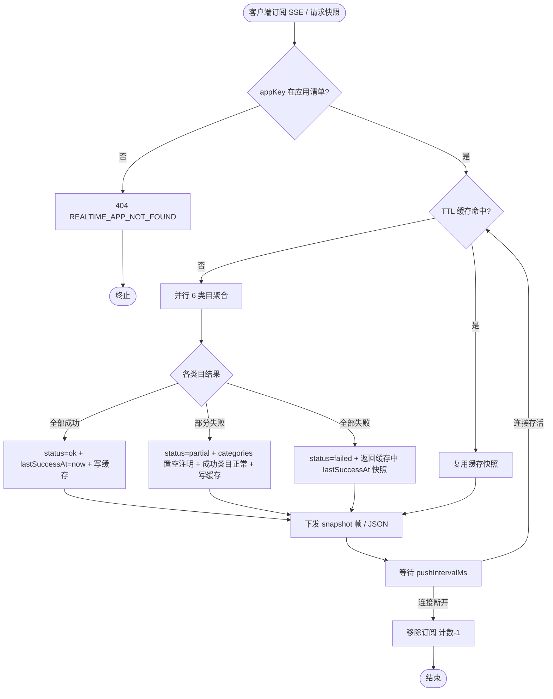
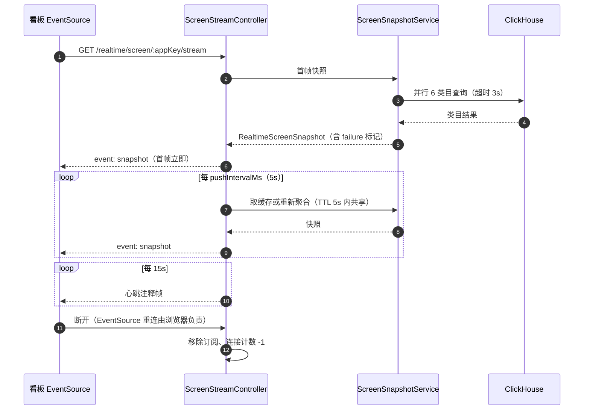

# 模块技术方案 — 01 RealtimeModule（实时数据服务）

> 所属：TDD V1 总纲　|　状态：`[待评审]`　|　目录：`apps/server/src/modules/realtime/`

## 1. 边界
应做：六类大屏数据聚合（指标/趋势/错误流/Top 榜/告警/达标率）、统计时点、失败标记、SSE 推送、REST 快照、进程内 TTL 缓存、连接背压。
不应做：采集写入、告警判定（只读告警记录）、历史报表导出、新鉴权模型、落新表、推送通道外的新存储。

## 2. 上下游依赖
| 方向 | 对象 | 产物/前提 | 方式 |
|---|---|---|---|
| 上游 | ClickHouseService | `wm_events`/`wm_errors` 只读聚合 | 同步查询（超时 3s/类目） |
| 上游 | PrismaService | `alertRecord`/`project` 只读 | 同步查询 |
| 下游 | 看板实时大屏 | SSE `snapshot` 帧 / REST `RealtimeScreenSnapshot` | 推送/拉取 |

## 3. 核心流程





## 4. 接口与服务设计
| 端点 | 方法 | 入参 | 出参 | 备注 |
|---|---|---|---|---|
| `/api/v1/realtime/screen/:appKey/stream` | GET(SSE) | path: appKey；query: 无 | `event: snapshot` 帧（`RealtimeScreenSnapshot` JSON）；15s 注释心跳 | 绕过 ResponseInterceptor（@Sse 原生流）；连接计数超 `maxClients` → 503 `REALTIME_CLIENT_LIMIT` + `Retry-After: 10` |
| `/api/v1/realtime/screen/:appKey/snapshot` | GET | path: appKey | 包裹器 `{ code:0, data: RealtimeScreenSnapshot }` | 首 paint/降级；错误码 `REALTIME_APP_NOT_FOUND` |

**服务类**（可编码粒度）：
```
ScreenSnapshotService
  + getSnapshot(appKey: string): Promise<RealtimeScreenSnapshot>   // TTL 缓存读穿
  - aggregate(appKey: string): Promise<RealtimeScreenSnapshot>     // Promise.allSettled 6 类目
  - aggregateMetrics / aggregateTrend / aggregateErrors / aggregateTopLists / aggregateAlerts / aggregateVitals
  - lastGood: Map<appKey, { snapshot; at: number }>                // 最后成功快照（failed 时续发）
  - cache: Map<appKey, { snapshot; expiresAt: number }>            // TTL = pushIntervalMs
ScreenStreamController
  + stream(appKey): Observable<MessageEvent>                        // @Sse；timer(0, pushIntervalMs).pipe(switchMap → getSnapshot)，takeUntil 断开
  - 15s 心跳：merge(interval(15000).mapTo({ type: 'heartbeat' }))（注释帧）
ScreenSnapshotController
  + snapshot(appKey): Promise<Envelope<RealtimeScreenSnapshot>>
```
**配置**（`configuration.ts` 增 `realtime: { pushIntervalMs=5000, retryBaseMs=10000, retryMaxMs=60000, maxClients=200 }`，env 同名大写）。
**types 扩展**（`packages/types/src/realtime.ts` + index 导出）：`RealtimeScreenSnapshot`、`ScreenMetrics`、`ScreenTrendPoint`、`ScreenErrorItem`、`ScreenTopItem`、`ScreenAlertItem`、`ScreenVitals`、`RealtimeFailure { status: 'ok'|'partial'|'failed'; categories: string[]; lastSuccessAt?: string }`。

**聚合口径落地**（PRD M01 §5 → SQL 要点）：
- 指标：`wm_events` 当日窗口（服务端时区 00:00 起，`buildBaseFilter`）count/uniqExact；活跃会话=近 5 分钟 `uniqExact(session_id)`；接口成功率取 api 事件成功占比（沿用 overview 模块口径）。
- 趋势：`GROUP BY toStartOfMinute(timestamp)` 近 60 分钟补空至 60 点（内存补齐）。
- 错误流：`wm_errors` ORDER BY timestamp DESC LIMIT 50，取 `fingerprint, type, message, url AS page, timestamp AS occurredAt`（「所属页面」= url 列）。
- Top 榜：慢接口=api 事件按 `name` 列（接口 URL 模板，沿用存量接口统计页分组口径）聚合 avg 耗时 Top5；方法维度如有需求从 extra JSON 提取；JS 错误=wm_errors 按 fingerprint count Top5；最差页面=pv 事件按 `name` 列（页面路径）聚合 `value` 列（loadTime）avg Top5，与 overview.avgPageLoad 同款口径。
- 告警：Prisma `alertRecord` where appKey AND（status=firing）取≤100 最新优先 + triggeredAt≥now-24h 全部（含 resolved）。
- 达标率：性能事件三指标「良好阈值占比」（沿用 overview vitals 口径），无样本→null。

## 5. 数据模型
无新增表（总纲 §6）；仅读存量。字段消费映射：`wm_events(timestamp, app_key, category, session_id, anonymous_id, name, value, …)`、`wm_errors(app_key, timestamp, fingerprint, type, message, url, …)`（存量实际列；无独立 event_id 列）、`AlertRecord(id, ruleName, metric, value, threshold, triggeredAt, status, appKey)`。

## 6. 实现细节与决策
1. **绕过包裹器**：`@Sse` 路由天然不经过 JSON 序列化包裹；REST 快照照常走 `ResponseInterceptor`。
2. **单定时器多订阅**：同一 appKey 的多个 SSE 订阅共享缓存（TTL 5s 内只有首个订阅触发真实聚合），避免 N 个挂屏 = N 倍查询（BE 复杂度预警落点）。
3. **失败标记**（SUM-23 口径）：「服务可达但供数失败」→ `failure.status`；连接层断开由客户端 EventSource 重连，服务端无感知义务。
4. **退避参数**：`retryBaseMs/retryMaxMs` 通过 SSE 帧的 `retry:` 字段下发给 EventSource（服务端控制重连节奏）。
5. **时区**：当日窗口按服务器本地时区 00:00（与存量 overview 一致）；`statsWindow.dayStartAt` 随快照下发。
6. **背压计数**：`Map<connectionId, appKey>` 维护连接数，`onUnmount` 递减；SSE 建连前校验。

## 7. TDD 测试用例（先测后码）

### Gherkin（承接 PRD AC）
```gherkin
Feature: RealtimeModule 供数
  Scenario: AC-M01-001 核心指标聚合
    Given ClickHouse 存在当日 pv/error/api 事件
    When getSnapshot(appKey)
    Then metrics 七项与 SQL 侧手工聚合一致且 failure.status='ok'

  Scenario: AC-M01-002 趋势 60 点补空
    Given 最近 60 分钟仅 30 分钟有数据
    When aggregateTrend
    Then trend 长度=60 且无数据分钟 pv/errors=null

  Scenario: AC-M01-003 错误流容量与排序
    Given wm_errors 有 60 条
    When aggregateErrors
    Then 返回 ≤50 条按 timestamp 倒序且每条含 fingerprint

  Scenario: AC-M01-004/013 Top 榜
    Given 接口/错误/页面数据充足或不足
    When aggregateTopLists
    Then 各 ≤5 条不足按实际；排序符合各自口径

  Scenario: AC-M01-005/012 告警读取
    Given 1 条 firing + 1 条 24h 内 resolved
    When aggregateAlerts
    Then unresolved 含 firing 且 recent24h 含 resolved（status 字段区分），unresolved ≤100

  Scenario: AC-M01-006/014 达标率
    Given 有/无性能样本
    When aggregateVitals
    Then 有样本返回三项+overall；无样本全 null

  Scenario: AC-M01-007/011 失败标记
    Given 达标率类目查询超时、其余成功
    When getSnapshot
    Then failure.status='partial'、categories 含 'vitals'、该类目置空、其余正常

  Scenario: AC-M01-008 服务恢复
    Given failure.status='failed' 且 lastGood 存在
    When 数据源恢复后下一轮聚合成功
    Then failure.status='ok' 且 generatedAt 刷新

  Scenario: AC-M01-009/010 应用校验
    When appKey 不在清单
    Then REST 返回 REALTIME_APP_NOT_FOUND；SSE 握手前拒绝

  Scenario: AC-M01-015 缓存共享
    Given TTL 窗口内两个订阅同 appKey
    When 各取一次快照
    Then 底层仅执行一轮聚合（CH 查询 spy 调用次数=6 非 12）

  Scenario: SSE 帧协议
    Given 订阅建立
    Then 首帧立即到达、Content-Type=text/event-stream、含 retry 帧=retryBaseMs、每 5s 一帧 snapshot、每 15s 心跳注释帧

  Scenario: 背压
    Given 活跃连接=maxClients
    When 新订阅到达
    Then 503 + REALTIME_CLIENT_LIMIT + Retry-After:10，存量连接不受影响
```

### 代码级骨架（vitest + @nestjs/testing）
```ts
describe('ScreenSnapshotService', () => {
  it('aggregate: 并行 6 类目全成功 → status ok，metrics 与 CH stub 一致', async () => { /* arrange CH stub rows → act → expect 断言七项 */ });
  it('partial: vitals 类目 reject → status partial，categories 含 vitals，vitals 各项 null，其余类目正常', async () => {});
  it('failed: 全类目 reject → 返回 lastGood 快照且 failure.status=failed、lastSuccessAt 为缓存时点', async () => {});
  it('cache: TTL 内二次 getSnapshot 不触发重新聚合（spy 调用次数不变）', async () => {});
  it('cache 过期后重新聚合', async () => { vi.advanceTimersByTime(5001); });
  it('trend 补空：60 点、null 分钟', async () => {});
  it('errors 容量 50 倒序且含 fingerprint', async () => {});
  it('alerts：firing/recent24h 分槽且各带上限', async () => {});
  it('vitals 无样本 → 全 null', async () => {});
});
describe('ScreenStreamController', () => {
  it('首帧立即发出且 event=snapshot', async () => { firstValueFrom(stream$) });
  it('appKey 无效时抛 REALTIME_APP_NOT_FOUND', async () => {});
  it('连接计数达 maxClients → HttpException 503 REALTIME_CLIENT_LIMIT', async () => {});
  it('重试帧 retry 值=retryBaseMs', async () => {});
});
```
覆盖映射：正向（001/004/005/006）· 边界（002/003/013/014）· 异常（007/008/010）· 幂等/并发（015、缓存）· 协议（SSE 帧/背压）。

## 8. 难点与异常
- 难点：类目级部分失败语义（置空 vs 旧值——PRD 禁止旧值冒充，故 partial 类目置空而非沿用缓存）；TTL 缓存与「首帧立即」的竞态（首帧允许等待一次真实聚合，超时 3s 则回退 lastGood/failed 标记）。
- 异常：CH 不可达（failed + lastGood 续发）；Prisma 不可达（告警类目置空 partial）；客户端半开连接（15s 心跳写失败由框架触发断开清理）。
