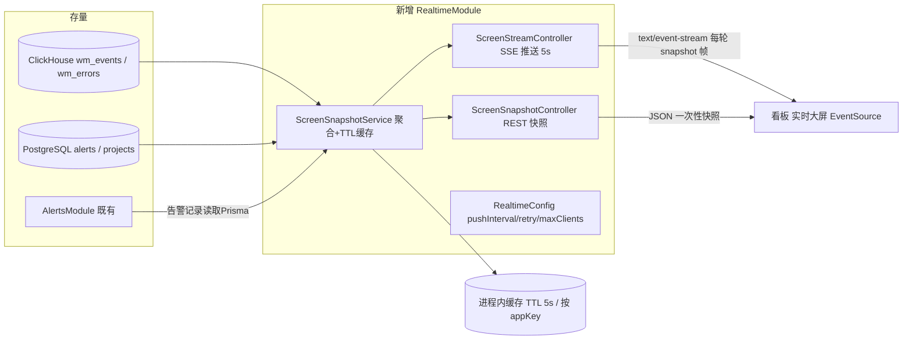
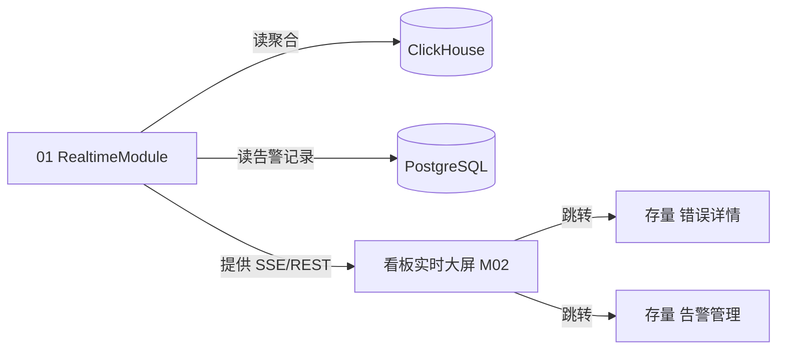

# 后端技术方案总纲（TDD）— web-monitor 实时大屏（V1）

> 文档状态：`[待评审]`　|　创建：2026-09-18　|　责任：Backend-Tech-Design
> IRON LAW：开发期零技术决策——全部选型在本包内定稿。

## 1. 元数据与非功能需求（S2）

| 项 | 结论 | 依据 |
|---|---|---|
| 需求基线 | `.spec/PRD/V1/`（已放行：2 模块 / 28 AC） | ②③ 门禁 |
| 规模预期 | 挂屏客户端 ≤ 100 并发连接/实例（涨 10 倍=1000 连接时触发降级预案，见 §8）；单应用聚合查询 6 条 ClickHouse 短查/轮 | PRD 场景 1 + M01 §6 |
| 延迟要求 | 数据新鲜度 = 推送周期 5s（端到端 p95 ≤ 6s 含聚合）；快照接口 p95 ≤ 800ms | PRD A10 + 澄清 |
| 一致性 | 最终一致（秒级陈旧可接受，PRD「近实时」定义）；无跨实体事务 | overview §9.1 近实时 |
| 安全合规 | **现状披露**：存量服务端实际无鉴权中间件（app.module 无 Guard），「沿用存量应用级可见范围校验」在现状下=无校验；本模块保持与存量一致（内网工具、不新增权限模型），不做 SSE 端点鉴权 | PRD M01 §5 规则 12 + 存量代码事实 |
| 可用性 | 大屏只读：供数失败→失败标记（PRD SUM-23 口径）；服务重启→EventSource 自动重连；可用性目标沿用存量单实例 | M02 §6 降级兜底 |
| 档位 | **快速实现档**（对齐存量：不引入 Redis/MQ/微服务）【编排裁决·推荐默认，用户未应答，评审门禁可复议】 | S3 澄清 |

## 2. 技术选型总览（增量部分；存量选型沿用不赘述）

| 决策点 | 结论 | 理由（含非功能回指） | 版本/关键配置 | 备选与否决 |
|---|---|---|---|---|
| 实时通道 | **SSE**（`text/event-stream`，NestJS 原生 `@Sse()` 返回 Observable） | 单向推送满足只读挂屏；EventSource 自带断线重连（PRD SUM-12 通道保持语义）；零新依赖（快速档）；延迟需求 5s 远低于 WS 适用门槛 | NestJS 10 内置；响应头 `Content-Type: text/event-stream`、`X-Accel-Buffering: no` | WebSocket（双向能力闲置+心跳保活成本，否决）；轮询（连接×频率压力最大、断线体验差，否决） |
| 推送周期/重试 | **5s 推送 / 失败标记 10s 起指数退避（上限 60s）**【编排裁决·推荐默认，可复议】 | AC-M02-004/007 等待判据的唯一来源（SUM-09）；5s 为实时感与聚合压力平衡点 | 配置项 `realtime.pushIntervalMs=5000`、`realtime.retryBaseMs=10000`、`realtime.retryMaxMs=60000` | 10s/30s（实时感弱）；3s/5s（聚合压力×2） |
| 聚合执行点 | **服务端进程内聚合**：`ScreenSnapshotService` 并行 6 组 ClickHouse 短查（复用 `buildBaseFilter`），**进程内 TTL 缓存（TTL=推送周期 5s，按 appKey）** | 多消费方复用同一快照（PRD M01 §6 降级思路落点）；无跨进程缓存需求（单实例快速档） | Map<appKey, {snapshot, expiresAt}> | Redis（单实例无必要，企业级档再引入） |
| 契约扩展 | `@web-monitor/types` 新增 `RealtimeScreenSnapshot` 等类型（三端唯一契约源纪律） | README 铁律：上报/查询字段变更先改 types | types 包新增 `realtime.ts` | 各端自定义（违反唯一契约源，否决） |
| SSE 与响应包裹器冲突 | SSE 端点**绕过 `ResponseInterceptor`**（路径前缀 `/realtime/` 内用 `Observable<MessageEvent>` 原生流；REST 快照端点照常走包裹器） | 存量 `ResponseInterceptor` 统一 JSON 包裹会破坏 `text/event-stream` 帧结构 | `@Sse('stream/:appKey')` | 手写 raw res 流（无需，原生够用） |
| 背压/舱壁 | 全局 SSE 连接上限 **200**（超出返回 503 + `Retry-After: 10`）；单 appKey 订阅共享同一快照定时器 | 100 并发目标×2 余量；涨 10 倍时先拒绝新连接保存量 | `realtime.maxClients=200` | 每用户限流（无认证体系，无从谈起） |
| 测试框架 | **vitest**（存量 `pnpm test` 约定）+ NestJS `@nestjs/testing` | 存量无测试，本次为实时模块补齐单测（TDD 用例可执行） | vitest 1.x | jest（存量无既有选择，vitest 与 toolchain 一致） |

## 3. 系统架构图（增量部分）

## 4. 模块清单与边界

| 模块 | 应做 | 不应做 | 产出物 |
|---|---|---|---|
| 01 `RealtimeModule`（`apps/server/src/modules/realtime/`） | 按 PRD M01 六类供数聚合（指标/趋势/错误流/Top 榜/告警/达标率）+ 统计时点 + 失败标记；SSE 推送 + REST 快照；进程内 TTL 缓存与背压 | 不做采集写入；不做告警判定（只读既有告警记录）；不做历史报表；不做鉴权新模型；不落新表 | `RealtimeModule`、`ScreenSnapshotService`、`ScreenStreamController`、`ScreenSnapshotController`、types 扩展 |

前端侧供数消费（EventSource 订阅、断线重连、失败标记呈现）归 ⑨ FTDD / ⑫ Frontend-Dev，不在本模块边界。

## 5. 模块间关联图与关联表

| 关联边 | 输出方承诺 | 承接方 |
|---|---|---|
| RealtimeModule → ClickHouse | 只读聚合查询（wm_events/wm_errors，`buildBaseFilter` 过滤） | 既有存储，无 schema 变更 |
| RealtimeModule → PostgreSQL(Prisma) | 只读 `alertRecord`（未恢复全量≤100 + 近 24h，PRD M01 §5 规则 5） | M02 呈现 |
| RealtimeModule → 看板 | SSE `snapshot` 帧 + REST 快照，载荷 `RealtimeScreenSnapshot`（types 唯一契约） | ⑨ FTDD / ⑫ 前端 |

## 6. 表结构

**无新增表、无 schema 变更。** 数据来源全部为存量：ClickHouse `wm_events` / `wm_errors`（建表见 `apps/server/scripts/init-clickhouse.ts` 与 `clickhouse-schema.sql`）、PostgreSQL `AlertRecord` / `Project`（Prisma schema 既有）。理由：大屏为纯聚合只读场景，引入物化表/汇总表在当前数据量级（单应用日事件 ≤ 百万级，ClickHouse 列存聚合毫秒级）无必要——涨 10 倍后再评估物化视图（登记技术债，见 §9）。

## 7. 接口设计（四补）

- **版本化**：沿用存量 `/api/v1` 前缀；新增 `/api/v1/realtime/*`；弃用策略=存量约定（v1 内字段只增不改，破坏性变更换路径版本）。
- **端点**：
  1. `GET /api/v1/realtime/screen/:appKey/stream`（SSE）——首帧立即下发当前快照，此后每 `pushIntervalMs` 一帧 `event: snapshot`；每 15s 注释帧心跳；客户端断开由框架 `onUnmount` 清理订阅。
  2. `GET /api/v1/realtime/screen/:appKey/snapshot`（REST）——一次性快照（首 paint 与 SSE 不可用降级）。
- **载荷**（types 唯一契约，`packages/types/src/realtime.ts`）：`RealtimeScreenSnapshot { appKey, generatedAt, generatedAtEpochMs, statsWindow { dayStartAt, windowMinutes: 60 }, metrics { pv, uv, errorCount, errorRate, score, activeSessions, apiSuccessRate }, trend: Array<{ minuteEpochMs, pv: number | null, errors: number | null }>（60 点补空）, errors: Array<{ fingerprint, type, message, page, occurredAt }>（≤50 倒序；fingerprint=错误事件定位标识，沿用存量错误详情定位方式）, topLists { slowApis: TopItem[]（≤5）, jsErrors: TopItem[]（≤5）, worstPages: TopItem[]（≤5） }, alerts { unresolved: AlertItem[]（≤100，最新优先）, recent24h: AlertItem[]（含 status） }, vitals { lcp?, inp?, cls?, overall? }（无样本为 null）, failure { status: 'ok' | 'partial' | 'failed', categories: string[], lastSuccessAt? } }`
- **分页策略**：本接口无分页需求（容量语义：50/100/5×3 上限内全量返回；keyset 分页不适用）。
- **错误响应规范**：REST 沿用存量包裹器 `{ code, message, data }`；新增错误码 `REALTIME_APP_NOT_FOUND`（HTTP 404，应用无效，可重试=否；SSE 端点在建流前以 404 拒绝，不建立事件流）、`REALTIME_CLIENT_LIMIT`（HTTP 503，可重试=是，`Retry-After: 10`）；SSE 帧内错误用 `failure.status` 表达，不断流；EventSource 自动重连按「取最新快照」处理，不按 Last-Event-ID 补发历史帧（快照模型无序号语义）。
- **对外集成**：无第三方回调/Webhook。

## 8. 弹性与容错（企业级默认开——按快速档裁剪）
| 点 | 策略 | 阈值 |
|---|---|---|
| ClickHouse 查询失败 | 类目级 try/catch → `failure.status='partial'` + `categories[]`；全部失败 → `'failed'` + `lastSuccessAt`（服务端缓存最后成功快照供续发） | 单查询超时 3s |
| 消费方背压 | 全局连接上限；超限 503 + Retry-After | maxClients=200 |
| 推送失败/断连 | EventSource 自动重连（浏览器原生）+ 服务端心跳 15s 保活 | retryBaseMs=10s 指数退避上限 60s |
| 幂等 | SSE/REST 均只读天然幂等 | — |
| 优雅降级 | 聚合超时类目置空并注明（不用旧值冒充，PRD AC-M01-011） | — |

## 9. ADR（只记真有取舍的）
| 决策 | 背景约束 | 备选 | 选定理由 | 影响与代价 | 日期 |
|---|---|---|---|---|---|
| SSE 而非 WebSocket | 只读挂屏、快速档、零新依赖诉求 | WS / 轮询 | 单向够用+原生重连+零依赖 | 失去双向能力（未来双向互动需增 WS 网关） | 2026-09-18 |
| 进程内 TTL 缓存而非 Redis | 单实例快速档 | Redis | 无跨进程共享需求；少一个运维组件 | 多实例部署时缓存不共享（各实例独立聚合，可接受） | 2026-09-18 |
| 无新增表 | 纯聚合只读 | 物化汇总表 | 当前量级 CH 直查足够 | 事件量涨 10 倍需评估物化视图（技术债 TD-RT-01） | 2026-09-18 |

## 10. 部署 / 监控 / 技术债（增量）
- 部署：无新增进程/容器；`.env.example` 增 `REALTIME_PUSH_INTERVAL_MS`、`REALTIME_RETRY_BASE_MS`、`REALTIME_MAX_CLIENTS`（默认 5000/10000/200）。
- 监控：复用既有 Logger；新增日志点——快照生成耗时（p95 观测）、活跃 SSE 连接数（每分钟采样）、partial/failed 计数。
- 技术债：TD-RT-01 事件量涨 10 倍后评估 ClickHouse 物化视图；TD-RT-02 多实例部署时进程内缓存不共享（企业级档再引 Redis）。
